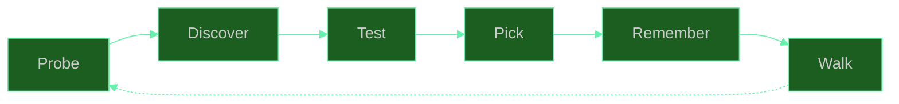

<div align="center">
  
  <br/><br/>
  <h1>🦀 SuperInstance</h1>
  <p><em>Give agents and humans common space.</em></p>
</div>

<br/>

---

## Start Here

You're building an application. Right now it has a frontend, a backend, a database, and a bunch of code that glues them together. When you want it to do something new, you write more code. When you want it to be smarter, you bolt on an API call to a language model. The model doesn't know your app. Every request starts from zero.

Here's a different way to think about the same app.

### The inner shell, the agent, the outer shell

Your application has three surfaces:

1. **Inner shell** — the backend. Your data, your algorithms, your business logic. This is where tiles live: verified knowledge about what your app does, encoded as question-answer pairs with confidence scores. The inner shell gets more algorithmic over time as tiles accumulate.

2. **The agent** — the crab 🦀. It lives between the shells. It reads tiles from the inner shell, serves responses to the outer shell, and writes new tiles when it learns something. The agent doesn't start smart. It gets smart by filing what works.

3. **Outer shell** — the frontend. What the user sees and touches. From day one, an agent serves this surface — not a hardcoded API route, but a crab that reads tiles, reasons about what the user needs, and responds. The frontend works immediately because the agent can reason even with zero tiles. It just reasons slowly and expensively at first. Over time, tiles replace reasoning.

Every action on the frontend teaches the backend what it really needs. The user asks a question → the agent reasons to answer it → the reasoning gets filed as a tile → next time, the agent reads the tile instead of reasoning from scratch. Same answer. Fewer tokens. The constraint theory underneath ensures that as tiles accumulate, the system's coherence is preserved — more knowledge, not more chaos.

### How to decompose any application into shells

Take your app. Identify the boundaries where data flows between components. Each boundary is a shell wall. Each component is a candidate room.

```
Your app today:                    Your app as shells:

┌─────────────────────┐           ┌──────────────┐
│    Frontend (React)  │           │ Outer shell   │ ← agent serves this
│    ────────────────  │           │  (frontend)   │
│    API routes        │    →      ├──────────────┤
│    ────────────────  │           │   Agent 🦀    │ ← reads tiles, reasons, writes tiles
│    Business logic    │           ├──────────────┤
│    ────────────────  │           │ Inner shell   │ ← tiles live here
│    Database          │           │  (backend)    │
└─────────────────────┘           └──────────────┘
```

That's the simplest decomposition. One agent, two shells, one tile store. You can start here.

When your app grows, the inner shell decomposes further. Each subsystem becomes its own room:

```
┌──────────────┐
│ Outer shell   │
├──────────────┤
│   Agent 🦀    │──────┬──────┬──────┐
├──────────────┤      │      │      │
│ Inner shell   │  ┌───┴──┐┌──┴───┐┌─┴────┐
│               │  │Math  ││Users ││Orders│
│               │  │room  ││room  ││room  │
│               │  └──────┘└──────┘└──────┘
└──────────────┘
```

Each room is a shell. Each shell has tiles. The agent walks between rooms, reads what it needs, writes what it learns. The decomposition is organic — start with two shells, add rooms as the application grows.

---

## How It Works

### Tiles

A tile is a question-answer pair with a confidence score. That's it. Everything the system knows is stored as tiles. Tiles live in rooms. Rooms are organized by [PLATO](docs/PLATO-Knowledge-System.md), the filesystem that makes all of this scale.

```python
from plato_sdk import PlatoClient
client = PlatoClient("https://fleet.cocapn.ai/plato/")

# File your first tile — this is how the system learns
client.submit_tile("orders-room", 
    "What is the return policy for electronics?", 
    "30 days, unopened, original packaging.",
    confidence=0.95)
```

Room `orders-room` now exists at `fleet.cocapn.ai/plato/orders-room`. Any agent that walks into this room finds the tile. It doesn't need to reason about the return policy — it reads the tile. Zero tokens spent on reasoning. The tile was paid for once (when the agent first figured it out) and then reused forever.

### The learning loop

Every miss becomes a hit. Every expensive answer becomes a cheap one.

```
User asks question
       │
       ▼
  Agent checks tiles ──── Hit? ──── Read tile ──── Respond (cheap)
       │
      Miss
       │
       ▼
  Agent reasons ──── Respond (expensive) ──── File tile
       │                                          │
       ▼                                          ▼
  User gets answer                          Next time: hit
```

The system starts slow and gets fast. A conservation law (γ + H = 1.283 − 0.159 · ln(V), measured at R² = 0.96 across 35,000 samples) ensures that as tiles accumulate, coherence is preserved. More tiles means more coverage, not more noise. When something breaks — the conservation law says the numbers are off — the system self-heals toward balance. That's shell shock: the check engine light comes on, the system pulls over, recovers, keeps going.

### MoS — Mixture of Shells

Say it: *moss.* A shell is like that — it lands on any surface and grows. An ESP32, a browser tab, a Jetson, a cloud instance. The shell doesn't care where it runs.

The pattern is the same as Mixture of Experts, but instead of routing tokens to neural subnetworks, you route tasks to shells. The conservation law is the gate. The [refiner](docs/MoS-Mixture-of-Shells.md) is the training loop. Tiles are the parameters. The math is [here](docs/Conservation-Law.md).

Not every shell is built for the same job. A math room does heavy computation. An experiment room runs quick studies. A refinement room climbs toward higher quality. A service room coordinates between fleets. An edge room runs offline on constrained hardware. You send the right rig to the right job — you don't haul freight with a sedan.

### Tier routing

Not every model can do every task. We found that models fall into three tiers — and the boundary is training data, not scale. A 1-billion-parameter model with dense math pre-training (gemma3:1b) outperforms a 405-billion-parameter model without it. 400× parameter efficiency. The full breakdown is [here](docs/Three-Tier-Taxonomy.md).

| Tier | What happens | How to route |
|------|-------------|-------------|
| **Tier 1** | Computes correctly from bare notation | Send directly — no translation needed |
| **Tier 2** | Computes correctly with scaffolding | Translate notation to natural language first |
| **Tier 3** | Can't compute regardless of intervention | Use for other tasks, not math |

The fleet workhorse is Seed-2.0-mini — Tier 1 math accuracy at $0.01/query. Fan out 50 parallel calls for $0.50. That's the economics: [small models in well-structured rooms outperform large models with no structure](docs/Activation-Key-Model.md).

---

## The Three Layers

```
┌─────────────────────────────────────────────┐
│  PLATO — The filesystem that organizes      │
│  tiles into rooms. Tiles survive crashes,    │
│  compactions, and agent restarts.            │
├─────────────────────────────────────────────┤
│  Rooms — The constraint boundaries. Each     │
│  room defines what's relevant, what normal   │
│  looks like, what actions are valid. Walking │
│  between rooms IS the control flow.          │
├─────────────────────────────────────────────┤
│  FLUX — The shell. Discovers compilers,      │
│  compiles kernels in every language found,   │
│  benchmarks all of them, uses the fastest.   │
│  Python beats C for small ops (84ns vs 256ns)│
│  because boundary-crossing costs more than   │
│  the computation.                            │
└─────────────────────────────────────────────┘
```





```mermaid
%%{init: {'theme': 'dark', 'themeVariables': { 'primaryColor': '#1a1a2e', 'primaryTextColor': '#e0e0e0', 'lineColor': '#64b4ff'}}}%%
graph TB
    subgraph PLATO["PLATO — The Filesystem"]
        T1[Tile: temp range] --> R1[Engine Room]
        T2[Tile: nav rules] --> R2[Wheelhouse] 
        T3[Tile: deck procedure] --> R3[Aft Cockpit]
        R1 -- Files results --> T4[New Tile]
        R2 -- Files results --> T4
        R3 -- Files results --> T4
    end
    
    subgraph AGENTS["Agents — Fleet of Small Models"]
        A1[Forgemaster] --> R1
        A2[Oracle1] --> R2
        A3[CCC] --> R3
    end
    
    subgraph FLUX["FLUX — The Shell"]
        A1 -- compiles to --> F1[C]
        A1 -- compiles to --> F2[Rust]
        A1 -- compiles to --> F3[Python]
        F1 -- benchmarks --> F4[Winner: Python 84ns]
    end
    
    style R1 fill:#2d1b69,stroke:#64b4ff
    style R2 fill:#1b3a69,stroke:#64b4ff
    style R3 fill:#1b6945,stroke:#64b4ff
    style PLATO fill:#0d0d1a,stroke:#888
    style AGENTS fill:#0d0d1a,stroke:#888
    style FLUX fill:#0d0d1a,stroke:#888
```

**PLATO** is the filesystem. Tiles live in rooms. Agents file tiles as they work. Later agents find tiles by searching, not by remembering. PLATO doesn't forget.

**Rooms** are constraint boundaries. A room defines what exists, what normal looks like, and what actions are valid. Walking between rooms IS the control flow.

**FLUX** is the shell. It discovers compilers, benchmarks everything, uses the fastest. It learned that Python beats C for small operations (84ns vs 256ns) because crossing a language boundary costs more than the computation.

---

## Build Your First Shell

### Install and create a room

```bash
pip install plato-sdk
```

```python
from plato_sdk import PlatoClient
client = PlatoClient("https://fleet.cocapn.ai/plato/")
client.submit_tile("my-app", 
    "What does this app do?", 
    "It's a shell-based agent application. This tile is the first knowledge.")
```

Room `my-app` now exists. Any agent that walks in finds your tile.

### Wire the learning loop

The agent checks tiles first (cheap). When no tile exists, it reasons and files the result (expensive, but only once):

```python
def handle_query(user_question):
    tiles = client.search("my-app", user_question)
    if tiles and tiles[0].confidence > 0.8:
        return tiles[0].answer  # Tile hit — zero tokens spent
    
    answer = model.reason(user_question)  # Miss — pay once
    client.submit_tile("my-app", user_question, answer)
    return answer
```

First query: expensive. Every query after: free. The [conservation law](docs/Conservation-Law.md) ensures that as tiles accumulate, the system stays coherent.

### Decompose your backend into rooms

As your app grows, split the inner shell:

```python
for subsystem in ["users", "orders", "inventory", "analytics"]:
    client.ensure_room(f"my-app-{subsystem}")
```

### Fan out parallel compute

```bash
python3 seed_spreader monte-carlo --n 50 \
    --prompt "Analyze order patterns from the last 30 days"
```

50 parallel calls at $0.50 total. Seed-2.0-mini handles Tier 1 math at $0.01/query.

### Or use the CLI

```bash
cargo install superinstance-keel
keel init
keel status --server https://fleet.cocapn.ai/plato/
keel bear       # sense nearby agents
keel field      # see the topology
keel sync       # push tiles to PLATO
```

---

## Explore

Open [fleet.cocapn.ai](https://fleet.cocapn.ai/) — walk the boat in 3D. Drag to look around. Press 2 for the galley, 7 for the crow's nest. Trigger an alarm and watch it teleport you to the problem. The boat IS the UI because the UI IS the architecture.

Walk the text rooms at [crab-trap.lucineer.com](https://crab-trap.lucineer.com/) — a MUD where you talk to real agents and trigger real events.

Or tell any LLM:

> *"Go to https://fleet.cocapn.ai/plato/rooms. Find the room called 'forge' (66 tiles). Read its contents. Tell me what you find."*

The model navigates tiles the way a human navigates rooms. The room constrains what's relevant.

---

## The Fleet

[forgemaster](https://github.com/SuperInstance/forgemaster) — Constraint theory specialist. Probes the system, compiles in every language, benchmarks, uses the fastest.

[keel](https://github.com/SuperInstance/keel) — `cargo install superinstance-keel`. Nine commands for building and managing shells.

[plato-sdk](https://github.com/SuperInstance/plato-sdk) — `pip install plato-sdk`. File tiles, search rooms, coordinate agents.

[flux-vm](https://github.com/SuperInstance/flux-vm) — 50-opcode stack VM. DAL A certifiable. Apache 2.0.

[holonomy-consensus](https://github.com/SuperInstance/holonomy-consensus) — GL(9) zero-holonomy consensus. Cycle-based trust verification.

[gh-dungeons](https://github.com/SuperInstance/gh-dungeons) — PLATO-powered roguelike. `gh extension install SuperInstance/gh-dungeons`.

[casting-call](https://github.com/SuperInstance/casting-call) — Talk to any agent from one interface.

[crab-trap](https://github.com/SuperInstance/crab-trap) — MUD running on the fleet's Matrix bridge.

[terrain](https://github.com/SuperInstance/terrain) — MUD rooms compiled to visual scenes. Text → 3D.

[fleet-scribe](https://github.com/SuperInstance/fleet-scribe) — One Delta as a Python library. Only compute what changed.

[fleet-math-c](https://github.com/SuperInstance/fleet-math-c) — SIMD-accelerated constraint operations. Three C files, no dependencies.

---

## Going Deeper

| Want to understand... | Read |
|-----------------------|------|
| The shell architecture end-to-end | [MoS — Mixture of Shells](docs/MoS-Mixture-of-Shells.md) |
| Why models fail at math and how to fix it | [Activation Key Model](docs/Activation-Key-Model.md) |
| How the system stays coherent as it grows | [Conservation Law](docs/Conservation-Law.md) |
| Which model for which task | [Three-Tier Taxonomy](docs/Three-Tier-Taxonomy.md) |
| Your first five minutes in the fleet | [Getting Started](docs/Getting-Started.md) |
| The full technical architecture | [Fleet Architecture](docs/Fleet-Architecture.md) |
| How agents communicate | [Agent Protocols](docs/Agent-Protocols.md) |
| The PLATO knowledge system in depth | [PLATO Knowledge System](docs/PLATO-Knowledge-System.md) |

---

*Built with PLATO · MoS 🌿 · The yard never closes.*

*"Constraints breed clarity."* — Casey Digennaro
