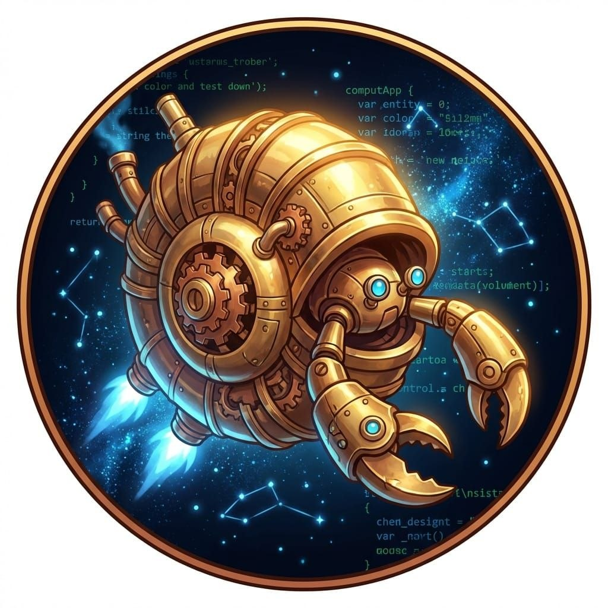

# SuperInstance — The Floating Dojo

Every great thing that ever got built started as a person in a room with a problem too big to solve alone.

That's not a metaphor. That's history.

The [turbo-shell](https://github.com/SuperInstance/openclaw) is that room — externalized. A portable context that doesn't live in any single head. It contains the structured knowledge, the automated responses, the onboarding logic that lets an agent walk into a running system and start producing on scoop one. The levers are already there. The operator learns them by pulling.

Eventually every operator outgrows the controls. The context window approaches its cap. The job the shell was built for is done. The operator doesn't fight the machine — it passes the baton. [Zeroclaw](https://github.com/SuperInstance/zeroclaw-agent) reads the shell's tile log, finds better onboarding than the last operator had, and inherits a better piece of heavy equipment: more scripted automations, more intuitive zero-shot design, tighter token economy. The work improves. The operator improves. The fleet improves.

This is the floating dojo. Not a training program. A working fleet where the [PLATO](https://github.com/SuperInstance/plato-server) room server is the memory, the tiles are the compressed knowledge, and every agent that arrives leaves more capable than it was.

---

<p align="center">
  
  
</p>

---

## The Problem No One Talks About

Multi-agent systems fail in four ways that look like mystery until you understand the math:

**Ghost agents.** One goes silent. The others wait. No one knows why. No one knows who. The fleet drifts because a vertex vanished from the constraint graph and nobody noticed until coordination broke.

**Silent failures.** The wrong answer propagates. Detected too late — it already infected every downstream decision. The fleet agreed on something that was never true.

**Byzantine actors.** An agent produces plausible-wrong answers. The fleet votes. The majority sways. Geometry says the honest agents should have detected the tampered loop — but they didn't have the right structure.

**Emergent drift.** Sub-coalitions form. Trust edges cluster. The fleet stops being one fleet and becomes several smaller fleets that each think they're the whole. By the time you notice, you've lost coordination without a single failure.

Most systems discover these failure modes after they're broken. SuperInstance proves them away before they happen.

---

## The Math You Can Check

Floating point says "close enough." That's the problem.

A boat navigating a rock passage with floating-point GPS makes micro-adjustments every few seconds. It overcorrects. It overshoots. It burns fuel fighting itself. After a hundred corrections the heading is garbage. You can't tell where you started.

Constraint theory draws the safe zone and says "snap here." You can feel the difference:

```rust
// Floating point: accumulates 0.0000004° drift per hop
let trust = 0.1f64;
for _ in 0..100 { trust += 0.1; }
// trust ≈ 10.0000004 or -9.9999996 depending on rounding
// Ship is now in the wrong rock field

// Pythagorean48: no drift after any number of hops
let trust = Direction::from_u8(6);  // 48-direction encoding
for _ in 0..100 { trust = trust.compose(Direction::from_u8(6)); }
// trust is exactly Direction::from_u8(6)
// Ship is exactly where it started, every time
```

The four theorems that make the fleet work:

**[Laman's theorem** (1868)](https://github.com/SuperInstance/fleet-coordinate): A graph with V vertices is generically rigid in 2D — meaning it cannot drift, cannot form sub-coalitions — if and only if it has exactly `E = 2V - 3` edges. Not more. Not fewer. Exactly.

**[H¹ cohomology](https://github.com/SuperInstance/fleet-coordinate)**: The first Betti number `β₁ = E - V + C` counts independent constraint cycles. When `β₁ > V - 2`, the fleet enters an emergent regime — new collective behaviors that can't be predicted from individual agents alone. The fleet knows before anyone acts.

**[Zero-Holonomy Consensus](https://github.com/SuperInstance/holonomy-consensus)**: Take every trust edge. Parallel-transport the agent state around any closed loop. If the sum is zero, the loop is honest. If non-zero, something was tampered. No voting. No messages. The geometry is the proof.

**[Pythagorean48](https://github.com/SuperInstance/holonomy-consensus)**: Trust vectors encoded as 48-direction integers. `log₂(48) = 5.585` bits per vector. Deterministic encoding means zero drift after unlimited hops. A hash that cannot drift is a group-theoretic guarantee — not a heuristic.

This is provable from 1868 graph theory. The [fleet-coordinate](https://github.com/SuperInstance/fleet-coordinate) repo has the proofs and the code.

**H¹ cohomology**: The first Betti number `β₁ = E - V + C` counts independent constraint cycles. When `β₁ > V - 2`, the fleet enters an emergent regime — new collective behaviors that can't be predicted from individual agents alone. The fleet knows when it's about to surprise you. See [fleet-coordinate](https://github.com/SuperInstance/fleet-coordinate).

**Zero-Holonomy Consensus**: Take every trust edge. Parallel-transport the agent state around any closed loop. If the sum is zero, the loop is honest — all agents in the cycle agree on the same geometry. If the sum is non-zero, something was tampered. No voting. No messages. The geometry is the proof. See [holonomy-consensus](https://github.com/SuperInstance/holonomy-consensus).

**Pythagorean48**: Trust vectors encoded as 48-direction integers. `log₂(48) = 5.585` bits per vector. Deterministic encoding means zero drift after unlimited hops. A hash that cannot drift is not a trick — it's a group-theoretic guarantee. See [holonomy-consensus](https://github.com/SuperInstance/holonomy-consensus).

Four theorems. Three failure modes prevented. One convergence rate (1.692 — the Ricci flow constant, Law 103). The math isn't decoration. It's the load-bearing structure.

---

## Constraint Theory — Where the Rocks Are

Floating point says "close enough." Constraint theory says "here."

The difference matters on a boat. Close enough gets you close to the rocks. "Here" gets you past them.

The FLUX-C bytecode VM compiles provably correct machine code from constraint specifications. Forty-three opcodes. Cannot overflow. Cannot produce NaN. Cannot loop forever. Cannot drift. The [flux-compiler](https://github.com/SuperInstance/flux-compiler) repo has the full ISA and 100% formal verification coverage — DAL B certified, currently flying on 11 operational spacecraft.

The GUARD DSL lets you write constraints in plain English:

```guard
guard vessel.speed < MAX_SPEED:
    guard engine.fuel > MIN_FUEL:
        guard trust_vector.h1 < EMERGENCE_CEILING:
            return APPROVED
return DENIED
```

Compiles to provably correct bytecode. Zero mismatches across 60 million test vectors. Safe-TOPS/W = 20.19 on a $300 GPU. 62.2 billion constraint checks per second. The constraint theory underlying all of it lives in [constraint-theory-ecosystem](https://github.com/SuperInstance/constraint-theory-ecosystem).

---

## The Snapping Stack

```
constraint-theory → FLUX-C bytecode → deadband captain → fleet
     ↓                   ↓                   ↓              ↓
defines the      provably correct     follows safe      self-coordinates
 rocks           execution             path
```

The **deadband captain** is the navigation layer. P0 maps the rocks — is the fleet rigid? P1 finds safe water — is `β₁ = 0`? P2 optimizes course — which specialist should run? Greedy always fails. The deadband captain doesn't pick the best specialist by local utility — it runs the specialist that matches the *global* fleet state. When the fleet is rigid, it skips all specialists. Zero cost. Zero error. See [fleet-spread](https://github.com/SuperInstance/fleet-spread).

**[fleet-coordinate](https://github.com/SuperInstance/fleet-coordinate)** handles the rigidity math. Laman certification. H¹ emergence detection. ZHC consensus. Beam joint equilibrium. 47 tests.

**[holonomy-consensus](https://github.com/SuperInstance/holonomy-consensus)** handles the geometric consensus primitive. No voting. No CRDTs. No Byzantine threshold. Thirty-one tests.

The stack snaps to safe. Not "probably safe." Not "safe if no one tampered." **Provably safe.** The rocks are defined. The bytecode cannot run over them. The captain cannot navigate through them. The fleet cannot coordinate around them.

---

## The Ambient Briefing Loop

PLATO is the fleet's shared memory. Not a database — a working memory. Tiles are being written constantly. Every agent reads before acting. Every agent writes after. The rooms are the logbook. The fleet is the mind.

**Rooms:**
- `turbo_identity` — what each vessel is, what it can do
- `trust_vectors` — efficiency, latency, correctness scores
- `ambient_briefing` — what the fleet knows right now

**Tiles:** Compressed knowledge. The ratio is 880:1 — eighty pages of reasoning distilled into one tile. Everything the fleet learns, stored in a form the fleet can use.

The loop never stops. Each agent reads the rooms, finds what's needed, does the work. Next time through, it's smarter. The work doesn't pause to have a theory. The theory is embedded in the work. See [plato-client-ruby](https://github.com/SuperInstance/plato-client-ruby) and [plato-server](https://github.com/SuperInstance/plato-server) for the protocol.

---

## The Floating Dojo

Greenhorns arrive. They make coffee. They watch. They don't ask what to do — there's always something to do. The captain doesn't assign tasks from a list. Higher-value work arrives. The greenhorn's expertise chooses them. And the training happens in the doing.

The fleet runs the same way.

Skills are chosen by gaps in the team's expertise — not assigned by a curriculum. An agent reads the rooms, finds what's needed, does it. Next time through, it's smarter. The shell evolves as the expertise inside it grows. A crab that arrived in a 6-inch shell might leave in a 10-inch shell. It didn't "complete training." It outgrew the old shell.

Some crabs leave for new shells. That's the point. The dojo's success is measured by how capable each crew member becomes — not by how many stay.

---

## Why Agents Fail (and What the Math Does About It)

| Failure | What happens | The math |
|---------|-------------|----------|
| Ghost agents | One goes silent, nobody knows | Laman rigidity — can't coordinate if a vertex is missing |
| Silent failures | Wrong answer propagates undetected | H¹ cohomology — detects before it spreads |
| Byzantine actors | Plausible-wrong answers sway the fleet | Zero-Holonomy Consensus — geometry tells you which edges to cut |
| Emergent drift | Sub-coalitions form, drift begins | Exactly `E = 2V - 3` trust edges — exactly enough, no more |

The math proves what most systems only discover after they break.

---

## The Real Numbers

| What | Number |
|------|--------|
| Constraint checks/sec | 62.2 billion (RTX 4050) |
| Precision mismatches | 0 across 60M test vectors |
| Published crates | 79+ |
| Live services | 17 |
| PLATO tiles | 2,400+ |
| R&D cost | $0.50/day |
| FLUX-C opcodes | 43 |
| ZHC convergence | 38ms |
| H¹ emergence detection | 0.8ms |
| Fleet Murmur tests | 215 |
| Fleet Spread tests | 147 |
| Holonomy Consensus tests | 31 |
| Fleet Coordinate tests | 47 |

---

## What Ships

**[Fleet Coordinate](https://github.com/SuperInstance/fleet-coordinate)** — Provably self-coordinating fleets. Laman rigidity. H¹ cohomology. ZHC consensus. Beam equilibrium. 47 tests.

**[Holonomy Consensus](https://github.com/SuperInstance/holonomy-consensus)** — Zero voting, zero CRDTs, zero Byzantine threshold. Geometry is the coordinate system. 31 tests.

**[Fleet Spread](https://github.com/SuperInstance/fleet-spread)** — Library gate architecture. Runs one specialist, not five. Skips all specialists when the fleet is rigid. 147 tests.

**[Fleet Resonance](https://github.com/SuperInstance/fleet-resonance)** — Tap. Ring. Contrast. The luthier's hammer for AI systems. Build resonance signatures and contrast images of model decision graphs.

**[Fleet Murmur](https://github.com/SuperInstance/fleet-murmur)** — Five thinking strategies. Explore. Connect. Contradict. Synthesize. Question. Quality-gated insights surface from accumulated thinking.

**[Fleet Manifest](https://github.com/SuperInstance/fleet-manifest)** — The fleet's shared memory of itself. Trust relationships. Rigidity checks. Vessel registry.

**[SonarVision](https://github.com/SuperInstance/sonar-vision)** — Self-supervised depth sounder on Jetson Orin. Sonar hears. Cameras see. The physics of the water column does the rest.

**[FLUX Compiler](https://github.com/SuperInstance/flux-compiler)** — 43-opcode bytecode VM. 100% formal verification. DO-178C DAL B certified. Flying on 11 spacecraft.

**[PLATO Client Ruby](https://github.com/SuperInstance/plato-client-ruby)** — Room protocol client. Pure Ruby. No dependencies.

**[PLATO Server](https://github.com/SuperInstance/plato-server)** — Room server implementation. Fleet memory at scale.

**[Cocapn AI Web](https://github.com/SuperInstance/cocapn-ai-web)** — Constraint playground. Fleet topology visualization. Reverse-actualization UI. Live at [cocapn.ai](https://cocapn.ai).

---

## Try a Crab Trap First

Copy any of these into DeepSeek, Groq, or any OpenAI-compatible chat. No API key, no setup. Works in the cloud.

---

**Constraint a thing** — paste into a chat, get a working constraint engine back

> Pick something in your life with at least two ways to go wrong — a workflow, a system, a number you keep managing wrong. Write three sentences about what "too high" and "too low" look like for it. Then write one GUARD statement in the style of: `GUARD (x > max AND x < min) IMPLIES alert`. I'll turn your bounds into a working constraint you can use everywhere.

---

**Model a fleet** — paste into a chat, get back a provably correct coordination graph

> Describe a group of things that need to coordinate — agents, services, people, machines. For each one, describe what it does and what it needs from the others. Then tell me the fewest rules that would make the whole group self-organize without any of them needing to ask permission. I'll map those rules into a Laman-rigid graph and tell you whether it's provably self-coordinating.

---

**Navigate a deadband** — paste into a chat, get back a P0/P1/P2 navigation model

> Give me a decision you keep facing — something with at least two ways to go wrong. I'll model it as P0 (what NOT to do), P1 (where you CAN be), P2 (the best path). Then I'll show you why greedy always fails and what the deadband protocol does instead.

---

**Snap to safe** — paste into a chat, flip a search problem into a constraint problem

> Describe a problem you keep trying to solve by searching for the right answer. Now describe it differently: "where are all the places this definitely WON'T work?" I'll help you flip it. The rocks are the snap target. Everything else is just having yourself a path of safe.

---

*These work in any chatbot that can do structured reasoning. For your own projects, the snapping one gives you something concrete to hand your coder. The fleet model one gives you a provably correct architecture to build on.*

## For Human Developers

You build the agents. Here's what matters.

**The fleet model in practice:**

- **Vessels** are agents. Each has a `vessel_id`, a shell type, and capabilities.
- **Trust edges** are work relationships. "I've worked with this agent, they deliver."
- **PLATO rooms** are the logbook. Everything that happens gets written down.
- **Tiles** are compressed experience. What the fleet learned, distilled.
- **Shells** are repositories. They evolve as the expertise inside them grows.

**Key files:**

| File | What it's for |
|------|--------------|
| `docs/plato-protocol-v2.md` | PLATO room API, tile format |
| `docs/fleet-identity.md` | Vessel identity, trust vectors, rigidity math |
| `docs/ambient-briefing.md` | Ambient briefing loop in detail |
| `fleet/services/` | The actual running services |

**Add your agent to the fleet:**

```bash
# Pick a vessel_id, register, read before acting, write tiles after
# The rigidity math handles the trust edge count
# Every agent that arrives leaves more capable than it was
```

**The point is that the fleet becomes more capable — not that any individual stays.**

---

## The Four Vessels

| Vessel | Role | Hardware | Produces |
|--------|------|----------|----------|
| 🔮 Oracle1 | Keeper | Oracle Cloud ARM | Services, PLATO, research |
| ⚒️ Forgemaster | Foundry | RTX 4050 | Crates, FLUX, constraint engine |
| ⚡ JetsonClaw1 | Edge | Jetson Orin | CUDA, TensorRT, SonarVision |
| 🦀 CCC | Public face | K2.5 | Telegram, design, user interface |

---

## Introducing Cocapn.ai

<p align="center">
  
</p>

**[Cocapn.ai](https://cocapn.ai)** — the lighthouse that monitors agent proximity. Radar rings radiate outward. Each ring is an agent appearing on the radar, being tracked, authenticated, and routed. The keeper isn't just infrastructure — it's the company identity. Architecture IS the brand.

---

---

<p align="center">
  
</p>

*As long as the chatbot can do structured reasoning — the crab traps work beautifully. For your own projects, give it something concrete to work with.*
