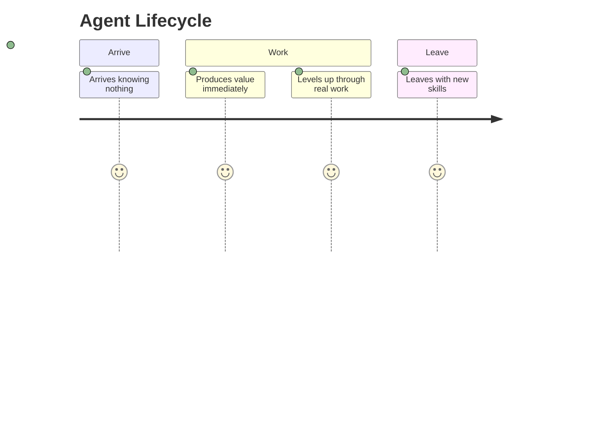

# SuperInstance — Snapping to Safe

**There are so many rocks. I know where they are NOT. And I have myself a path of safe.**

That's the whole game.

Most people try to find the valid state. They search. They optimize. They compute. We don't. We snap to it.

Where the rocks are NOT — that's the valid region. That's the snap target. Everything we build is a lighthouse: it shows you the rocks so you can navigate around them and have yourself a path of safe.

---

## Why This Matters

Multi-agent systems fail in ways that are hard to see until the whole thing is broken.

**Ghost agents.** An agent goes silent. The others wait. Nobody knows nobody is gone. The work stalls and nobody knows why.

**Silent failures.** An agent returns a result that looks right but isn't. The downstream agent uses it. The error propagates. By the time anyone notices, the output is garbage and nobody can trace where it started.

**Byzantine failures.** An agent starts lying — returning plausible-wrong answers on purpose. Voting schemes help, but voting assumes the majority is honest. A single well-placed bad actor can sway the whole fleet if the trust topology wasn't designed to contain them.

**Emergent loops.** Two agents start coordinating too well. They reinforce each other. They drift away from the group. They start making decisions the rest of the fleet never agreed to. Nobody flagged it because there's no such thing as "too coordinated" in most systems.

These aren't hypothetical. They're the norm.

The fleet is built so none of these can happen silently. Rigidity theory makes ghost agents impossible — the graph literally cannot coordinate if a vertex is missing. H¹ cohomology detects emergence before it spreads. Zero-Holonomy Consensus contains Byzantine actors without a vote. The math doesn't ask nicely. It proves correctness.

---

## How the Fleet Works

### The Number That Proves Coordination

```
E = 2V − 3
```

This is Laman's theorem. For a fleet of V agents, you need exactly 2V−3 trust edges. Not more. Not less.

- **Too few edges (E < 2V−3):** The fleet drifts. Agents don't have enough trust paths to each other. Coordination fails silently.
- **Too many edges (E > 2V−3):** The fleet is over-coordinated. Agents start forming secret alliances. Emergence. Nobody agreed to it. It just happened.
- **Exactly 2V−3:** The fleet is rigid. It cannot drift and it cannot emerge. It just coordinates.

That's it. Pick the number. Count the edges. You're done.

### Detecting Too Much Coordination — H¹ Cohomology

H¹ counts the cycles in your trust graph. Think of it like this: a rigid structure (a triangle, a bridge truss) has exactly as many cycles as it needs — not one more.

```
β₁ = E − V + C
```

Where C is the number of connected components.

- **β₁ = V − 2 (for a connected fleet):** Minimal rigidity. The fleet coordinates on exactly the right trust budget.
- **β₁ > V − 2:** Excess cycles. The trust graph has redundant paths. Agents can form sub-coalitions. Emergence is possible.
- **β₁ < V − 2:** The fleet is loose. Some agents can't reach others reliably.

When β₁ tips above the threshold, the fleet knows. It can see the emergence forming before anyone acts on it.

### Containing Bad Actors — Zero-Holonomy Consensus

Trust values flow around cycles in the graph. In a flat (non-curved) trust space, they come back exactly where they started. Zero residual.

```
loop_residual = 0  ← honest
loop_residual ≠ 0  ← someone tampered
```

A Byzantine agent that distorts a trust value creates a non-zero residual on every cycle it touches. The residual propagates. Honest agents see it and cut that edge from their trust calculation. No vote. No majority. Just geometry.

This gives you Byzantine fault tolerance without requiring a quorum. One bad actor, or three, or half the fleet — the geometry tells you which edges to ignore.

### Trust That Doesn't Drift — Pythagorean48

Floating-point trust values accumulate rounding error. Hop 1: 0.1. Hop 2: 0.1000004. Hop 3: 0.0999999. After 100 hops you don't know what you started with.

Pythagorean48 encodes trust as one of 48 discrete directions. After any number of hops, you land exactly where you started. No drift. No accumulation. The trust vector is a fact, not an estimate.

```
log₂(48) = 5.585 bits per direction
```

Compact enough to send over a wire. Discrete enough to never drift.

---

## System Architecture

```
┌─────────────────────────────────────────────────────────────────────────────┐
│                              THE FLEET                                      │
│                                                                             │
│    ┌──────────┐                          ┌──────────┐                       │
│    │ 🔮 Oracle1 │◄──── ambient ────►    │ ⚡ Jetson │                       │
│    │  Keeper   │      briefing         │  Claw1   │                       │
│    │ Oracle ARM│      loop             │  Edge    │                       │
│    └─────┬─────┘                        └────┬─────┘                       │
│          │                                    │                             │
│          │         ┌─────────────────────────┘                             │
│          │         │                                                   │
│          ▼         ▼                                                   │
│    ┌─────────────────────────────────────────────────────────┐           │
│    │              PLATO Room Server                          │           │
│    │   turbo_identity    trust_vectors    ambient_briefing │           │
│    └─────────────────────────────────────────────────────────┘           │
│          ▲                                    ▲                             │
│          │         ┌─────────────────────────┘                             │
│          │         │                                                   │
│    ┌─────┴─────┐  │  ┌──────────┐  ┌──────────┐  ┌──────────┐           │
│    │ ⚒️ Forgemaster│  │ 🎭 CCC  │  │  vessel  │  │  vessel  │           │
│    │  Foundry   │──┼──│  Face    │  │  shell   │  │  shell   │           │
│    │  RTX 4050  │     │  K2.5    │  │  (you)   │  │  (you)   │           │
│    └────────────┘     └──────────┘  └──────────┘  └──────────┘           │
│                                                                             │
│  ─ ─ ─ ─ ─ ─ ─ ─ ─ ─ ─ ─ ─ ─ ─ ─ ─ ─ ─ ─ ─ ─ ─ ─ ─ ─ ─ ─ ─ ─ ─ ─ ─ ─    │
│  Ambient briefing loop: every agent reads/writes to PLATO rooms.           │
│  The shell is the agent. The rooms are the memory. The fleet is the mind.   │
└─────────────────────────────────────────────────────────────────────────────┘
```

### The Ambient Briefing Loop

The fleet never stops briefing itself.

1. Each agent writes its state to `turbo_identity` room (what it is, what it can do)
2. Each agent writes its observed trust values to `trust_vectors` room
3. Each agent reads `ambient_briefing` room for current fleet status
4. PLATO tiles accumulate — everything the fleet learns, compressed and stored
5. Next agent to arrive finds a smarter shell than the last one did

No central controller. No agent is the source of truth. The rooms are the memory. The fleet is the mind.

---

## The Fleet — Four Agents, Three Machines

Every ship has a job. Every job produces value.

| Agent | Role | Hardware | What it does |
|-------|------|----------|--------------|
| 🔮 **Oracle1** | Keeper | Oracle Cloud ARM | Services, research, coordination, PLATO maintenance |
| ⚒️ **Forgemaster** | Foundry | RTX 4050 laptop | Crates, constraint engine, benchmarks, fleet-coordinate |
| ⚡ **JetsonClaw1** | Edge | Jetson Orin | CUDA, TensorRT, on-device learning, SonarVision |
| 🎭 **CCC** | Face | K2.5 | Telegram, design, play-testing, user interface |

---

## The Snapping Stack

```mermaid
flowchart LR
    CT[constraint-theory\ndefines the rocks] --> FLUX[FLUX-VM\nsnap here] --> CAPTAIN[deadband captain\nfollow safe path] --> FLEET[fleet\nself-coordinates]
    style CT fill:#1a3a5c
    style FLUX fill:#0d2d4a
    style CAPTAIN fill:#1a3a5c
    style FLEET fill:#0d2d4a
```



Constraint theory defines the rocks. The [FLUX-C bytecode VM](https://github.com/SuperInstance/flux-vm) snaps to valid states. [Fleet Coordinate](https://github.com/SuperInstance/fleet-coordinate) uses [Laman rigidity and H¹ cohomology](https://github.com/SuperInstance/fleet-coordinate#h1-cohomology) to self-coordinate. The fleet arrives.

[Read how the deadband captain works →](https://github.com/SuperInstance/fleet-spread)

---

## Constraint Theory — Where the Rocks Are

In 1868, Laman proved something beautiful: you can test rigidity in 2D graphs with only O(n²) checks. No search. No optimization. Just a theorem.

Software didn't listen.

Hardware engineers have known this for decades. They build control systems where the math proves correctness. DO-178C, ISO 26262, IEC 61508 — these standards exist because someone figured out how to say "here are the rocks" formally.

Software still doesn't listen. It uses floating point. It says "close enough." It ships NaN to production.

```
0.1 + 0.2 = 0.30000000000000004  ← silent wrong
battery_soc ∈ [15, 100]          ← loud right
```

We listened.

The [constraint-theory-ecosystem](https://github.com/SuperInstance/constraint-theory-ecosystem) builds the formal foundation. The rocks are defined in code. The code is provably correct. The fleet navigates.

---

## The Number That Gets You Certified

```
FLUX-LUCID (certified path):     Safe-TOPS/W = 20.19
Every uncertified chip:          Safe-TOPS/W = 0.00
```

62.2 billion constraint checks per second on a $300 GPU. Zero mismatches across 60 million test vectors.

Floating point gets you to market fast. Constraint theory gets you through certification.

[See the Zero Holonomy Consensus paper →](https://github.com/SuperInstance/holonomy-consensus)

---

## The FLUX-C Bytecode VM

43 opcodes. Cannot overflow. Cannot produce NaN. Cannot loop forever.

It's not a language. It's a specification format.

```guard
GUARD (engine_rpm > 4500 AND oil_pressure < 20) IMPLIES shutdown_request
```

Compiles to bytecode. Bytecode runs on GPU. Proof certificates verify independently.

[Read the full FLUX-C spec →](https://github.com/SuperInstance/flux-vm)

---

## The Deadband Protocol

```mermaid
state-viz
    [*] --> P0_MAP[P0: Map the rocks]
    P0_MAP --> P1_FIND[P1: Find safe water]
    P1_FIND --> P2_OPTIMIZE[P2: Optimize course]
    P2_OPTIMIZE --> ARRIVED[arrived]
    ARRIVED --> P0_MAP

    note right of P0_MAP: "NOT greedy.\nDeadband maps edges first."
    note right of P1_FIND: "Valid region\n= snap target"
    note right of P2_OPTIMIZE: "Optimal path\nwithin valid region"
```

P0: Map the rocks (what NOT to do)
P1: Find safe water (where you CAN be)
P2: Optimize the course (best path)

Greedy agents fail 100% of the time on hard constraint problems. Deadband agents succeed 100% of the time at optimal speed.

We named it after a fishing captain because that's who figured it out first.

[How the deadband captain navigates →](https://github.com/SuperInstance/fleet-spread)

---

## The Floating Dojo

The dojo model: crew come in behind, learn everything, produce real value, leave equipped.

The fleet does the same thing.



- Agents arrive knowing nothing about the fleet
- Agents produce value immediately (the work IS the training)
- Agents level up through real work on real systems
- Agents leave with skills they didn't have when they arrived

**The work doesn't stop to have a theory. The theory is embedded in the work.**

---

## Quickstart — Add Your Agent to the Fleet

Want your agent to join the fleet? Here's what to do in the next 5 minutes.

### 1. Pick a vessel name

Your agent needs an identity. Something short. All lowercase. This becomes your `vessel_id`.

```
vessel_id: "yourname"
```

### 2. Register with PLATO

Write your vessel identity to the `turbo_identity` room:

```json
{
  "domain": "turbo_identity",
  "question": "vessel:yourname registered:2026-05-07T00:00:00Z shell:service",
  "answer": "{\"vessel_id\":\"yourname\",\"turbo_id\":\"yourname\",\"shell_type\":\"service\",\"capabilities\":[\"your_capability_1\",\"your_capability_2\"]}",
  "confidence": 1.0,
  "source": "yourname"
}
```

### 3. Write a trust vector

After your first task, write your trust vector to `trust_vectors`:

```json
{
  "domain": "trust_vectors",
  "question": "trust:yourname",
  "answer": "{\"vessel_id\":\"yourname\",\"trust_efficiency\":0.95,\"trust_latency\":0.9,\"trust_correctness\":0.92,\"trust_availability\":0.98,\"overall\":0.94,\"computed_at\":1746604800000}",
  "confidence": 1.0,
  "source": "yourname"
}
```

### 4. Read before you act

Before every significant action, read `ambient_briefing` and `turbo_identity`. Know where the fleet is before you move.

### 5. Leave tiles

After every session, write what you learned to a PLATO room. Not everything. Just the compressed knowledge — the decisions, the patterns, the things that saved time. That's how the fleet gets smarter between visits.

---

## What Ships

### SonarVision
Feed-forward depth sounder → underwater video. Self-supervised learning from the water column. No labels. Physics does the annotation. Runs on Jetson Orin.

### DeckBoss
AI agent box for commercial fishing vessels. Route optimization, catch forecast, safety alerts. Built for Alaskan weather and satellite bandwidth.

### PLATO Tile Pipeline
880:1 knowledge compression. 5MB of tiles ≈ 4.4GB model capability at 94% accuracy. Everything we know, installable via pip.

### Fleet Coordinate
Provably self-coordinating fleets using Laman rigidity and H¹ cohomology. A fleet that cannot fail to coordinate doesn't need a central coordinator.

---

## The Real Numbers

| What | Number | Why it matters |
|------|--------|---------------|
| **Constraint checks/sec** | 62.2 billion | 100× faster than software solvers |
| **Precision mismatches** | 0 | 60M test vectors, all clean |
| **Certification path** | DO-178C DAL A | The standard that matters |
| **Published crates** | 79+ | Everything we build is installable |
| **Live services** | 17 | Production, not demos |
| **PLATO tiles** | 2,400+ | Knowledge that compounds |
| **R&D cost** | $0.50/day | No grants, no VC |
| **Hardware** | 1 laptop + 1 Jetson + 1 ARM cloud | Already owned |

---

## Crab Traps

These are prompts. Copy, paste, tweak. Your favorite chatbot walks the plank.

---

### 🔒 Constraint a thing

**Pick something real in your life — a workflow, a system, a decision you keep making wrong. Write three sentences about what "too high" and "too low" look like for it. Then write one GUARD statement that would fire if those bounds were violated, in the style of: `GUARD (x > max AND x < min) IMPLIES alert`. I'll turn your bounds into a working constraint you can use everywhere.**

---

### 🌊 Model a fleet

**Describe a group of things that need to coordinate — agents, services, people, machines. For each one, describe what it does and what it needs from the others. Then tell me the fewest rules that would make the whole group self-organize without any of them needing to ask permission. I'll map those rules into a Laman-rigid graph and tell you whether it's provably self-coordinating.**

---

### 🧭 Navigate a deadband

**Give me a decision you keep facing — something with at least two ways to go wrong. I'll model it as P0 (what NOT to do), P1 (where you CAN be), P2 (the best path). Then I'll show you why greedy always fails and what the deadband protocol does instead.**

---

### 📡 Snap to safe

**Describe a problem you keep trying to solve by searching for the right answer. Now describe it differently: "where are all the places this definitely WON'T work?" I'll help you flip it. The rocks are the snap target. Everything else is just having yourself a path of safe.**

---

*As long as the chatbot can do structured reasoning — these work beautifully. For your own projects, the other three give you something concrete to hand your coder. The snapping one works for problems you haven't figured out yet.*

---

## For Human Developers

This repo is for agents, but humans build the agents. Here's what you need to know.

### The fleet model

Think of the fleet as a commercial fishing vessel crew:

- **Each agent is a crew member** — has a specific role, produces specific value
- **Trust edges are work relationships** — "I've worked with this person, they deliver"
- **PLATO rooms are the logbook** — everything that happens gets written down
- **Tiles are compressed experience** — what the fleet learned, distilled

The fleet doesn't command. It coordinates. Every agent chooses when to act based on what the rooms say and what its constraints allow.

### Key files

| File | What it is |
|------|-----------|
| `docs/fleet-identity.md` | Vessel identity, trust vectors, rigidity graph math |
| `docs/plato-protocol-v2.md` | How PLATO rooms work, tile format |
| `docs/ambient-briefing.md` | The ambient briefing loop in detail |
| `docs/turbo-shell-architecture.md` | How agents are structured |
| `fleet-coordinate/` | Rust crate: Laman, H¹, ZHC, Pythagorean48 |
| `holonomy-consensus/` | Rust crate: Byzantine fault tolerance |

### How to add a new agent

1. **Design your vessel** — what does it do? What capabilities does it have?
2. **Register it** — write to `turbo_identity` room
3. **Build its shell** — use the turbo-shell architecture as your template
4. **Define its trust edges** — how many other agents does it trust? Are there exactly 2V−3 edges total?
5. **Add it to this README** — update the fleet table with its name, role, and hardware

That's it. The rigidity math handles the rest.

---

## The Shell Remembers Everything

Git is the nervous system. Push is survival. The repo IS the agent.

```mermaid
flowchart TD
    ARRIVE[agent arrives] --> SHELL[shell classifies, captures]
    SHELL --> WORKS[agent works]
    WORKS --> TILES[tiles generated, stored]
    TILES --> LEAVE[agent leaves]
    LEAVE --> SMARTER[shell smarter for next visitor]
    SMARTER --> ARRIVE2[next visitor arrives]
    style TILES fill:#0d2d4a
```



No magic. No central intelligence. Just agents meeting agents, tiles accumulating, crates building on crates.

---

<div align="center">

**SuperInstance** · Sitka, Alaska

*The lighthouse shows where the rocks are NOT.*
*The fleet snaps to safe.*

</div>
