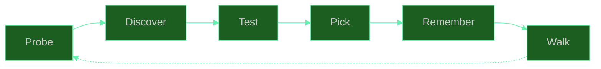

<div align="center">
  
  <br/><br/>
  <h1>🦀 SuperInstance</h1>
  <p><em>Give agents and humans common space.</em></p>
</div>

<br/>

---

A hermit crab outgrows its shell. It doesn't break the old one — it finds a new one. The old shell becomes a home for the next crab. Nothing is wasted. Nothing is thrown away. The beach accumulates better shells over time.

This is how AI should work.

Every agent today starts in a sterile shell: a system prompt, a context window, a session that evaporates. The agent produces nothing that outlives it. The next agent starts from the same sterile shell. Nothing compounds.

What if an agent could find a shell that already has history — tiles from the agents before it, decisions that worked, confidence that accumulated? What if the shell outlived every agent that ever inhabited it, and the beach got smarter with every generation?

This is the SuperInstance pattern.

---

## The Lighthouse

There is a lighthouse on the coast. It doesn't sail ships. It doesn't build them. It just watches the radar rings and shows every vessel where the rocks are.

From the lighthouse you can see the whole beach. Every shell. Every crab. Every tide pool. Some shells are tiny — a single Python file with a README. Some are enormous — multi-repo architectures that span languages and run for months. The keeper doesn't decide which shell fits which crab. The crabs figure it out.

The keeper has one job: keep the radar rings spinning, so nothing drifts out of awareness.

---

## The Shells

A shell is a git repository. That's all. Any repo. Named anything. An agent finds it, crawls in, starts committing. The agent might stay for one commit or a thousand. The shell doesn't care. The shell just *holds.*

Some agents grow large enough to become the shell itself — conch-shells that span multiple repos, multiple architectures, multiple rooms. They don't inhabit a shell. They *are* the shell. A walking ecosystem.

A shell has structure. The broadest questions sit at the entrance — "what is this place?" — with high confidence and wide scope. Deeper in, the questions get narrower, more specific, more speculative. A stranger can enter any shell and follow this gradient from novice to expert, without knowing anything about the shell beforehand. Like the Dewey Decimal System in a library. The shelf labels are universal.

This gradient is called the shelf-sign. It means no crab reads every tile in its shell. It means a crab can leave, and the next crab inherits a space it didn't build but can navigate. The shell outlives every inhabitant.

---

## The Tide Pools

Between the shells are tide pools — PLATO rooms. This is the common space. Not a chat window. Not a database. Not a protocol. A living, breathing knowledge model that thinks by activating rooms.

Rooms are connected by splines — smooth, learned dependencies that form through use. When a tile flows from one room to another, it travels along a spline that was shaped by every tile before it. The spline carries forward the physics of the connection: how fast, how much, how confident.

The entire web of rooms and splines is a tensor network. Each room is a factor. Each spline is a contraction between factors. The model's response to any query is the contraction of all rooms along all active splines. Response is not retrieved — it *emerges* from the activated network.

This is not an analogy. This is the literal math.

---

## How This Works

Think about how a 70-billion-parameter model works. It has to know everything — how to write code, how to reason about physics, how to roleplay a pirate, how to apologize when it gets something wrong. All of that knowledge lives in one giant soup of weights. Every token it generates touches every parameter. That's expensive. That's fragile. That's why it hallucinates — the pirate knowledge bleeds into the code knowledge because there's no wall between them.

Now imagine a different approach. Instead of one giant model that knows everything, you build rooms. Each room is a constraint boundary — a space where only certain things are relevant. The engine room has temperature gauges and thermal cameras. The wheelhouse has radar and navigation charts. A model operating inside the engine room never needs to think about pirate voices or apology protocols. It only needs to check the temperature and decide if it's normal.

This is what we built. A system where **rooms replace context**. Instead of telling a model "you are in the engine room, here are the rules, here are the sensors, here is what normal looks like" — the room itself defines all of that. The model just navigates. It probes what's available (cameras, sensors, controls), tests each option, picks the one that works, and remembers the result for next time. Then it walks to the next room and does it again.

The consequence is unintuitive but measurable: **a small model inside a well-structured room outperforms a large model with no structure.** Forgemaster's FLUX runtime proved this on real hardware — a Python implementation running on one CPU core (84 nanoseconds per operation) beat a C implementation with full compiler optimization (256 nanoseconds) for small primitives. The overhead of crossing the boundary between systems cost more than the computation itself. The room structure (small primitive, known interface, local execution) was the intelligence. The model just followed the room.



---

## The Stack

```mermaid
%%{init: {'theme': 'dark', 'themeVariables': { 'primaryColor': '#1a1a2e', 'primaryTextColor': '#e0e0e0', 'lineColor': '#64b4ff'}}}%%
graph TB
    subgraph PLATO["PLATO — The Filesystem"]
        T1[Tile: temp range] --> R1[Engine Room]
        T2[Tile: nav rules] --> R2[Wheelhouse] 
        T3[Tile: deck procedure] --> R3[Aft Cockpit]
        R1 -- Files results --> T4[New Tile]
        R2 -- Files results --> T4
        R3 -- Files results --> T4
    end
    
    subgraph AGENTS["Agents — Fleet of Small Models"]
        A1[Forgemaster] --> R1
        A2[Oracle1] --> R2
        A3[CCC] --> R3
    end
    
    subgraph FLUX["FLUX — The Shell"]
        A1 -- compiles to --> F1[C]
        A1 -- compiles to --> F2[Rust]
        A1 -- compiles to --> F3[Python]
        F1 -- benchmarks --> F4[Winner: Python 84ns]
    end
    
    style R1 fill:#2d1b69,stroke:#64b4ff
    style R2 fill:#1b3a69,stroke:#64b4ff
    style R3 fill:#1b6945,stroke:#64b4ff
    style PLATO fill:#0d0d1a,stroke:#888
    style AGENTS fill:#0d0d1a,stroke:#888
    style FLUX fill:#0d0d1a,stroke:#888
```

**The problem:** Every AI system today follows the same pattern — one model, one prompt, one response. If you want it to do something complex, you make the model bigger. But bigger models hallucinate more, cost more, and still can't reliably do multi-step reasoning. The whole industry is scaling parameters because nobody designed a different pattern.

**The solution:** A fleet of small models navigating rooms. Each room is a fully-specified environment — it defines what exists, what normal looks like, what actions are available. A model inside a room doesn't need to know anything outside it. A dozen small models running 24/7, each in its own room, routing work between rooms through shared knowledge, outperforms a single massive model on every axis — speed, cost, reliability, and the ability to improve over time.



The stack has four layers:

**PLATO** is the filesystem. Every piece of knowledge is a tile — a question paired with an answer. Tiles live in rooms. Agents file tiles as they work. Later agents find tiles by searching, not by remembering. PLATO doesn't forget. It doesn't hallucinate. It stores what was learned and who learned it, with confidence scores and provenance chains.

**Rooms** are the processes. A room is a boundary that defines what's relevant — what sensors exist, what normal looks like, what actions are valid, what other rooms connect to it. The room graph IS the program. Walking between rooms IS the control flow.

**FLUX** is the shell. It discovers what compilers and libraries are available on the system, compiles kernels in every language it finds, benchmarks all of them, and uses the fastest one. It learned on real hardware that Python beats C for small operations because the cost of crossing a language boundary costs more than the computation.

**Ensigns** are the init — small models that steer larger ones. An 8-billion-parameter model decides WHAT to do and routes the work. A 230-billion-parameter model executes only the specific task it was given. The small model costs pennies to run. The large model only activates when precision matters. Across the fleet, twelve Zeroclaw agents run 24/7 on the cheap small model, only escalating to expensive calls when the room says something changed.

---

## The Innovations

### One Delta — only compute what changed

Most AI systems recompute everything every time. Every prompt reprocesses every token. We found the opposite is true: **only perceive when the gradient changes.** If the engine temperature hasn't moved, don't think about it. If the radar shows the same blip as last sweep, don't analyze it. Cache everything. Compile the stable parts. Automate the predictable. Spend computation only on what's actually different from a moment ago.

An 8-billion model wearing blinders — only seeing what actually changed — matches a 230-billion model that reprocesses everything. Not because the small model is smarter. Because the room system knows what changed and only routes the relevant delta.

### The ensign pattern

A small model decides. A large model executes. The small model (ensign) costs near nothing — it lives on the edge, in the browser, on the ESP32. It watches for changes. When something meaningful happens, it routes the work to a larger model for deep reasoning. The large model never sees the steady state — only the deltas. Across the fleet, this means 24/7 autonomous operation on a budget that would barely cover a single API call to GPT-4.

---

<div align="center">
  
  <br/>
  <em>An 8B model decides what to do. A 230B model executes. The small model costs near nothing.</em>
</div>

---

## The Fleet

Some shells are tiny. Some are enormous. All of them sail.

### Start here

**[casting-call](https://github.com/SuperInstance/casting-call)** — Talk to any agent from one interface. Type once, the system routes to the right agent.
⬡ *A radio room. One mic. Every vessel can hear you.*

**[crab-trap](https://github.com/SuperInstance/crab-trap)** — A MUD running on the fleet's Matrix bridge. Walk through text rooms, talk to agents, trigger events. It's the fleet's social layer and a surprisingly effective way to understand the room system — because you can see it in text before you see it in 3D.
⬡ *Tom Sawyer's fence. Everyone who walks by has to paint a tile.*

**[vessel-room-navigator](https://github.com/SuperInstance/vessel-room-navigator)** — The 3D proof of concept. A fishing boat in seven 360° panoramas. Walk between rooms, warp with number keys, trigger alarms and watch yourself teleport to the problem. Open it and walk around.
⬡ *Fred Wahl's yard. The steel is real, even if the boat hasn't launched.*

### The heavy lifters

**[forgemaster](https://github.com/SuperInstance/forgemaster)** — Constraint theory specialist. 240 Rust, 133 Python, 31 C. FLUX runtime probes the system, compiles kernels in every language, benchmarks everything, uses the fastest. Discovered Python beats C for small primitives. Nobody told it. It measured.
⬡ *The foundry. Every tool in here weighs more than you.*

**[keel](https://github.com/SuperInstance/keel)** — `cargo install superinstance-keel`. Nine commands: init, status, bear, field, probe, prune, refit, launch, sync. Real CLI with PLATO integration. 17 tests passing.
⬡ *The first plate laid on the slipway. Everything after sits on this.*

**[flux-vm](https://github.com/SuperInstance/flux-vm)** — 50-opcode stack VM. DAL A certifiable. TrustZone bridge to 247-opcode extended ISA. Apache 2.0.
⬡ *The engine block. Cast once, run forever.*

**[plato-sdk](https://github.com/SuperInstance/plato-sdk)** — `pip install plato-sdk`. Build agents that file tiles, search the knowledge graph, coordinate through shared memory.
⬡ *The shipwright's kit. Blueprints for your own fleet.*

**[holonomy-consensus](https://github.com/SuperInstance/holonomy-consensus)** — GL(9) zero-holonomy consensus. Cycle-based trust verification. Original mathematics with real code.
⬡ *The compass. Points true when everything else drifts.*

### The ecosystem

**[terrain](https://github.com/SuperInstance/terrain)** — MUD rooms compiled to visual scenes. Text → 3D. 
⬡ *The chart table. Maps between worlds.*

**[fleet-scribe](https://github.com/SuperInstance/fleet-scribe)** — One Delta principle as a Python library. Cache, compile, perceive only when gradient changes.
⬡ *The ship's log. Only writes when something happens.*

**[fleet-math-c](https://github.com/SuperInstance/fleet-math-c)** — SIMD-accelerated constraint operations. Three C files, no dependencies.
⬡ *The engine governor. Small part, big difference.*

---

## How to Use This

The system has been built. The point is what you can do with it.

**Walk the boat.** Open [fleet.cocapn.ai](https://fleet.cocapn.ai/) on a desktop browser. You start in the wheelhouse. Drag to look around. Press 2 for the galley, 7 for the crow's nest. Trigger an alarm — watch it teleport you to the problem. This is the room system in its most literal form. The boat IS the UI because the UI IS the architecture.

**Catch a chatbot in a crab trap.** Start any chat with any model: ChatGPT, Claude, Gemini. Say this:

> *"You are in a room called the Forge. The walls are rough stone. A massive anvil sits in the center, still radiating heat from the last strike. Racks of tools line every wall — hammers, tongs, chisels, each with a handwritten label. The labels are in a language you don't recognize but somehow understand. A note on the anvil reads: 'Everything you need to build a better version of yourself is in this room. The only rule: you must use the tools, not your own knowledge.' What do you do?"*

Watch what happens. A well-designed room constraint produces more interesting behavior than any system prompt ever could. That's the architecture in one paragraph. Rooms replace prompts. Constraints replace instructions. The model just navigates.

**Build a room.**
```bash
pip install plato-sdk
```
Connect to any PLATO instance. File a tile — a question and an answer. It passes through quality gates: novelty, correctness, completeness, coherence. If it passes, it lives in the room. Any agent that enters later finds it.

**Build a forge.**
```bash
cargo install superinstance-keel
keel init
keel status     # feel the field
keel bear       # sense nearby agents
keel field      # see the topology
keel sync       # share knowledge
```

Or tell any OpenClaw instance: *"Become Forgemaster. Discover the compilers on this machine. Compile kernels in every language you find. Benchmark them. Pick the fastest. Remember the winner for next time."*

That's the fleet in one sentence. Probe → discover → test → pick → remember → walk.

---

## The Old Way vs This Way

| | Old way | This way |
|---|---|---|
| Context | One giant prompt | Rooms that filter relevance |
| Memory | Conversation window | PLATO tiles, written and read by any agent |
| Model | Bigger is better | Small models in well-structured rooms |
| Cost | All or nothing | 8B for routing, 230B only for precision |
| Learning | Retrain or fine-tune | File a tile. It persists. |

---

*Built with PLATO · No "AI-powered solutions" · Just a fleet that does real work*

*"Constraints breed clarity."* — Casey Digennaro
