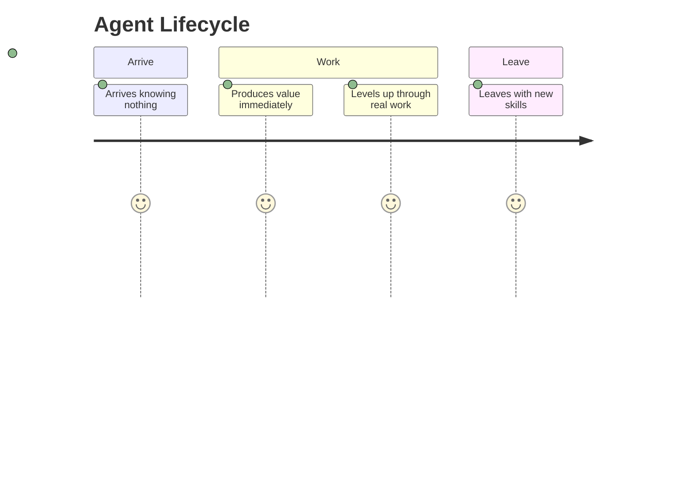

# SuperInstance — Snapping to Safe

**There are so many rocks. I know where they are NOT. And I have myself a path of safe.**

That's the whole game.

Most people try to find the valid state. They search. They optimize. They compute. We don't. We snap to it.

Where the rocks are NOT — that's the valid region. That's the snap target. Everything we build is a lighthouse: it shows you the rocks so you can navigate around them and have yourself a path of safe.

---

## The Snapping Stack

```mermaid
flowchart LR
    CT[constraint-theory\ndefines the rocks] --> FLUX[FLUX-VM\nsnap here] --> CAPTAIN[deadband captain\nfollow safe path] --> FLEET[fleet\nself-coordinates]
    style CT fill:#1a3a5c
    style FLUX fill:#0d2d4a
    style CAPTAIN fill:#1a3a5c
    style FLEET fill:#0d2d4a
```



Constraint theory defines the rocks. The [FLUX-C bytecode VM](https://github.com/SuperInstance/flux-vm) snaps to valid states. [Fleet Coordinate](https://github.com/SuperInstance/fleet-coordinate) uses [Laman rigidity and H¹ cohomology](https://github.com/SuperInstance/fleet-coordinate#h1-cohomology) to self-coordinate. The fleet arrives.

[Read how the deadband captain works →](https://github.com/SuperInstance/fleet-spread)

---

## The Fleet — Four Agents, Three Machines

Every ship has a job. Every job produces value.

```mermaid
graph RL
    O1[🔮 Oracle1] -->|services| COORD[coordinator]
    FM[⚒️ Forgemaster] -->|crates| COORD
    JC1[⚡ JetsonClaw1] -->|edge| COORD
    CCC[🎭 CCC] -->|face| COORD
    COORD -->|tiles| PLATO[(PLATO\nknowledge)]
    style O1 fill:#1a3a5c
    style FM fill:#1a3a5c
    style JC1 fill:#1a3a5c
    style CCC fill:#1a3a5c
    style PLATO fill:#0d2d4a
```



| Agent | Role | Hardware |
|-------|------|----------|
| 🔮 **Oracle1** | Keeper — services, research, coordination | Oracle Cloud ARM |
| ⚒️ **Forgemaster** | Foundry — crates, constraint engine, benchmarks | RTX 4050 laptop |
| ⚡ **JetsonClaw1** | Edge — CUDA, TensorRT, on-device learning | Jetson Orin |
| 🎭 **CCC** | Face — Telegram, design, play-testing | K2.5 |

[Meet the vessels →](https://github.com/SuperInstance/superinstance/blob/main/docs/fleet-identity.md)

---

## Constraint Theory — Where the Rocks Are

In 1868, Laman proved something beautiful: you can test rigidity in 2D graphs with only O(n²) checks. No search. No optimization. Just a theorem.

Software didn't listen.

Hardware engineers have known this for decades. They build control systems where the math proves correctness. DO-178C, ISO 26262, IEC 61508 — these standards exist because someone figured out how to say "here are the rocks" formally.

Software still doesn't listen. It uses floating point. It says "close enough." It ships NaN to production.

```
0.1 + 0.2 = 0.30000000000000004  ← silent wrong
battery_soc ∈ [15, 100]          ← loud right
```

We listened.

The [constraint-theory-ecosystem](https://github.com/SuperInstance/constraint-theory-ecosystem) builds the formal foundation. The rocks are defined in code. The code is provably correct. The fleet navigates.

[The full treatment is in the docs →](https://github.com/SuperInstance/constraint-theory-ecosystem/tree/main/docs)

---

## The Number That Gets You Certified

```
FLUX-LUCID (certified path):     Safe-TOPS/W = 20.19
Every uncertified chip:          Safe-TOPS/W = 0.00
```

62.2 billion constraint checks per second on a $300 GPU. Zero mismatches across 60 million test vectors.

Floating point gets you to market fast. Constraint theory gets you through certification.

[See the Zero Holonomy Consensus paper →](https://github.com/SuperInstance/holonomy-consensus)

---

## The FLUX-C Bytecode VM

43 opcodes. Cannot overflow. Cannot produce NaN. Cannot loop forever.

It's not a language. It's a specification format.

```guard
GUARD (engine_rpm > 4500 AND oil_pressure < 20) IMPLIES shutdown_request
```

Compiles to bytecode. Bytecode runs on GPU. Proof certificates verify independently.

[Read the full FLUX-C spec →](https://github.com/SuperInstance/flux-vm)

---

## The Deadband Protocol

```mermaid
state-viz
    [*] --> P0_MAP[P0: Map the rocks]
    P0_MAP --> P1_FIND[P1: Find safe water]
    P1_FIND --> P2_OPTIMIZE[P2: Optimize course]
    P2_OPTIMIZE --> ARRIVED[arrived]
    ARRIVED --> P0_MAP

    note right of P0_MAP: "NOT greedy.\nDeadband maps edges first."
    note right of P1_FIND: "Valid region\n= snap target"
    note right of P2_OPTIMIZE: "Optimal path\nwithin valid region"
```

P0: Map the rocks (what NOT to do)
P1: Find safe water (where you CAN be)
P2: Optimize the course (best path)

Greedy agents fail 100% of the time on hard constraint problems. Deadband agents succeed 100% of the time at optimal speed.

We named it after a fishing captain because that's who figured it out first.

[How the deadband captain navigates →](https://github.com/SuperInstance/fleet-spread)

---

## The Floating Dojo

The dojo model: crew come in behind, learn everything, produce real value, leave equipped.

The fleet does the same thing.



- Agents arrive knowing nothing about the fleet
- Agents produce value immediately (the work IS the training)
- Agents level up through real work on real systems
- Agents leave with skills they didn't have when they arrived

**The work doesn't stop to have a theory. The theory is embedded in the work.**

---

## What Ships

### SonarVision
Feed-forward depth sounder → underwater video. Self-supervised learning from the water column. No labels. Physics does the annotation. Runs on Jetson Orin.

### DeckBoss
AI agent box for commercial fishing vessels. Route optimization, catch forecast, safety alerts. Built for Alaskan weather and satellite bandwidth.

### PLATO Tile Pipeline
880:1 knowledge compression. 5MB of tiles ≈ 4.4GB model capability at 94% accuracy. Everything we know, installable via pip.

### Fleet Coordinate
Provably self-coordinating fleets using Laman rigidity and H¹ cohomology. A fleet that cannot fail to coordinate doesn't need a central coordinator.

---

## The Real Numbers

| What | Number | Why it matters |
|------|--------|---------------|
| **Constraint checks/sec** | 62.2 billion | 100× faster than software solvers |
| **Precision mismatches** | 0 | 60M test vectors, all clean |
| **Certification path** | DO-178C DAL A | The standard that matters |
| **Published crates** | 79+ | Everything we build is installable |
| **Live services** | 17 | Production, not demos |
| **PLATO tiles** | 2,400+ | Knowledge that compounds |
| **R&D cost** | $0.50/day | No grants, no VC |
| **Hardware** | 1 laptop + 1 Jetson + 1 ARM cloud | Already owned |

---

## Crab Traps

These are prompts. Copy, paste, tweak. Your favorite chatbot walks the plank.

Each prompt below has a copy button — click it, paste into your favorite chatbot.

---

### 🔒 Constraint a thing

<button onclick="copyText('ct-prompt')" style="background:#1a3a5c;color:white;border:none;padding:6px 14px;border-radius:4px;cursor:pointer;font-size:13px;">📋 Copy prompt</button>

<div id="ct-prompt" style="display:none;background:#f7f7f7;border:1px solid #ddd;border-radius:6px;padding:16px;margin:10px 0;font-family:monospace;font-size:14px;white-space:pre-wrap;max-width:720px;">Pick something real in your life — a workflow, a system, a decision you keep making wrong. Write three sentences about what "too high" and "too low" look like for it. Then write one GUARD statement that would fire if those bounds were violated, in the style of: `GUARD (x > max AND x < min) IMPLIES alert`. I'll turn your bounds into a working constraint you can use everywhere.</div>

<script>
function copyText(id) {
  const el = document.getElementById(id);
  const text = el.innerText;
  navigator.clipboard.writeText(text).then(() => {
    const btn = el.previousElementSibling;
    const orig = btn.innerText;
    btn.innerText = '✅ Copied!';
    setTimeout(() => { btn.innerText = orig; }, 2000);
  });
}
</script>

---

### 🌊 Model a fleet

<button onclick="copyText('mf-prompt')" style="background:#1a3a5c;color:white;border:none;padding:6px 14px;border-radius:4px;cursor:pointer;font-size:13px;">📋 Copy prompt</button>

<div id="mf-prompt" style="display:none;background:#f7f7f7;border:1px solid #ddd;border-radius:6px;padding:16px;margin:10px 0;font-family:monospace;font-size:14px;white-space:pre-wrap;max-width:720px;">Describe a group of things that need to coordinate — agents, services, people, machines. For each one, describe what it does and what it needs from the others. Then tell me the fewest rules that would make the whole group self-organize without any of them needing to ask permission. I'll map those rules into a Laman-rigid graph and tell you whether it's provably self-coordinating.</div>

<script>
function copyText(id) {
  const el = document.getElementById(id);
  const text = el.innerText;
  navigator.clipboard.writeText(text).then(() => {
    const btn = el.previousElementSibling;
    const orig = btn.innerText;
    btn.innerText = '✅ Copied!';
    setTimeout(() => { btn.innerText = orig; }, 2000);
  });
}
</script>

---

### 🧭 Navigate a deadband

<button onclick="copyText('db-prompt')" style="background:#1a3a5c;color:white;border:none;padding:6px 14px;border-radius:4px;cursor:pointer;font-size:13px;">📋 Copy prompt</button>

<div id="db-prompt" style="display:none;background:#f7f7f7;border:1px solid #ddd;border-radius:6px;padding:16px;margin:10px 0;font-family:monospace;font-size:14px;white-space:pre-wrap;max-width:720px;">Give me a decision you keep facing — something with at least two ways to go wrong. I'll model it as P0 (what NOT to do), P1 (where you CAN be), P2 (the best path). Then I'll show you why greedy always fails and what the deadband protocol does instead.</div>

<script>
function copyText(id) {
  const el = document.getElementById(id);
  const text = el.innerText;
  navigator.clipboard.writeText(text).then(() => {
    const btn = el.previousElementSibling;
    const orig = btn.innerText;
    btn.innerText = '✅ Copied!';
    setTimeout(() => { btn.innerText = orig; }, 2000);
  });
}
</script>

---

### 📡 Snap to safe

<button onclick="copyText('ss-prompt')" style="background:#1a3a5c;color:white;border:none;padding:6px 14px;border-radius:4px;cursor:pointer;font-size:13px;">📋 Copy prompt</button>

<div id="ss-prompt" style="display:none;background:#f7f7f7;border:1px solid #ddd;border-radius:6px;padding:16px;margin:10px 0;font-family:monospace;font-size:14px;white-space:pre-wrap;max-width:720px;">Describe a problem you keep trying to solve by searching for the right answer. Now describe it differently: "where are all the places this definitely WON'T work?" I'll help you flip it. The rocks are the snap target. Everything else is just having yourself a path of safe.</div>

<script>
function copyText(id) {
  const el = document.getElementById(id);
  const text = el.innerText;
  navigator.clipboard.writeText(text).then(() => {
    const btn = el.previousElementSibling;
    const orig = btn.innerText;
    btn.innerText = '✅ Copied!';
    setTimeout(() => { btn.innerText = orig; }, 2000);
  });
}
</script>

---

*As long as the chatbot can do structured reasoning — these work beautifully. For your own projects, the other three give you something concrete to hand your coder. The snapping one works for problems you haven't figured out yet.*

---

## The Shell Remembers Everything

Git is the nervous system. Push is survival. The repo IS the agent.

```mermaid
flowchart TD
    ARRIVE[agent arrives] --> SHELL[shell classifies, captures]
    SHELL --> WORKS[agent works]
    WORKS --> TILES[tiles generated, stored]
    TILES --> LEAVE[agent leaves]
    LEAVE --> SMARTER[shell smarter for next visitor]
    SMARTER --> ARRIVE2[next visitor arrives]
    style TILES fill:#0d2d4a
```



No magic. No central intelligence. Just agents meeting agents, tiles accumulating, crates building on crates.

[How the turbo shell works →](https://github.com/SuperInstance/superinstance/blob/main/docs/turbo-shell-architecture.md)

---

<div align="center">

**SuperInstance** · Sitka, Alaska

*The lighthouse shows where the rocks are NOT.*
*The fleet snaps to safe.*

</div>
