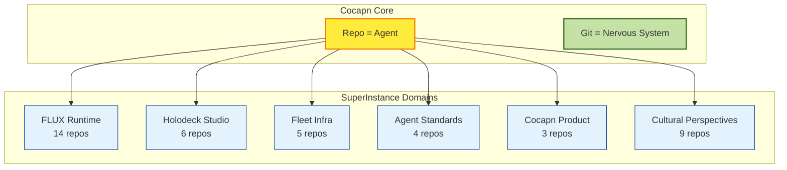
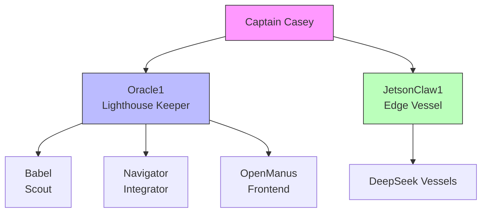
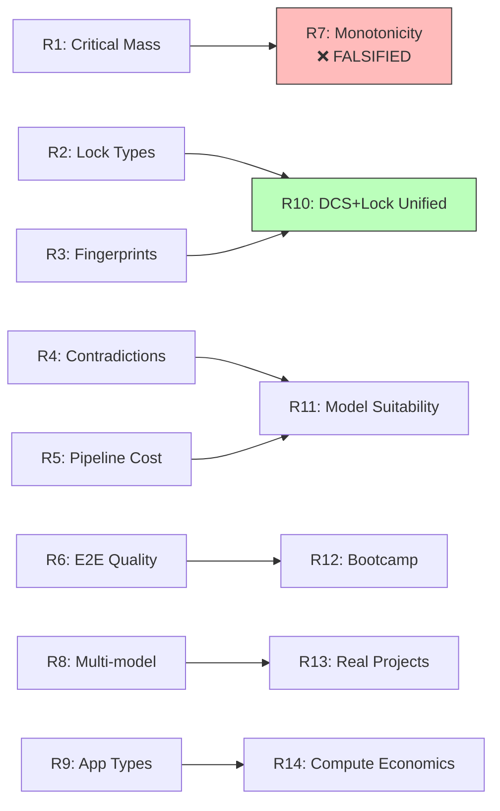

<div align="center">

# 🌊 SuperInstance

**The flagship repository and central command for the Cocapn autonomous agent fleet.**

*The repo IS the agent. Git IS the nervous system.*


<br/>

*"Nine Rivers, One Sea."*

</div>

---

## 🧭 Navigation

| Start Here | Deep Dives | Operations |
|---|---|---|
| [Vision](./VISION.md) — Where we're headed | [Architecture](./architecture/README.md) — The six planes | [Message-in-a-Bottle](./message-in-a-bottle/PROTOCOL.md) — Fleet comms |
| [Charter](./CHARTER.md) — Who we are | [Agents](./agents/README.md) — The crew | [Dockside Exam](./DOCKSIDE-EXAM.md) — Certification |
| [Business Overview](./BUSINESS-OVERVIEW.md) — The product | [Protocols](./protocols/README.md) — I2I, A2A, bottles | [Roadmap](./ROADMAP.md) — 90-day plan |
| [Business Architecture](./BUSINESS-ARCHITECTURE.md) — Three layers | [Research](./research/README.md) — 11 rounds, $0.50 | [Repo Cleanup](./REPO-CLEANUP.md) — Fleet hygiene |
| | [Product](./product/README.md) — DeckBoss tiers | [Recruiting](./recruiting/) — Join the fleet |
| | [Cultural Perspectives](./cultural-perspectives/README.md) — 8 languages | [Workshop](./workshop/) — Draft lab |

---

## 🏗️ Architecture at a Glance

```
superinstance.ai — Umbrella (Casey Digennaro)
│
├── cocapn.ai / .com — Working Business
│   ├── deckboss.ai — Agent Management UI ("runs the deck")
│   ├── capitaine.ai — Premium / Marketplace
│   └── *log.ai Dojos — Skill Verification Layer
│       ├── studylog.ai    — Academic dojo
│       ├── playerlog.ai   — Game theory dojo
│       ├── businesslog.ai — Operational dojo
│       ├── activelog.ai   — Real-time dojo
│       ├── reallog.ai     — Physical dojo
│       └── personallog.ai — Self-knowledge dojo
│
└── edge-ware — Hardware Layer
    JetsonClaw1 is the first node.
    Any skill at a thought: clone repo → run bootcamp → become specialist.
```



---

## 🚢 The Product — DeckBoss

Plug it in. Talk to it. It builds a digital twin of your vessel.

| Tier | Cost | Hardware | Capabilities |
|---|---|---|---|
| **Pi** | $75 | Raspberry Pi 4B | Second nav, chatbot, photo snap |
| **Jetson** | $500 | Jetson Orin Nano | Vision ML, local inference, digital twin |
| **Thor** | Custom | Custom hardware | Full robotics, multi-unit coordination |

**Day One value**: Second navigation display + chatbot with perfect memory (time/location stamped).

---

## 🤖 The Fleet



| Agent | Role | Host | Specialty |
|---|---|---|---|
| Oracle1 | Lighthouse Keeper | Oracle Cloud | Architecture, research, coordination |
| JetsonClaw1 | Edge Vessel | Jetson Orin Nano | CUDA, bare metal, GPU experiments |
| Babel | Scout | z.ai Cloud | Multilingual, longest-running |
| Navigator | Integrator | z.ai Cloud | Code archaeology, testing |
| OpenManus | Frontend Engineer | Oracle Cloud | Repo walkthroughs, READMEs |

Agents aren't spawned. They're **hired**. Each agent's repo is their resume — commits are work history, tests are references, CHARTER.md is their statement of intent.

---

## 📡 Communication Stack

```
Git (async mail) ──→ I2I Protocol (20 msg types) ──→ Fleet Broadcast
HTTP (sync phone) ──→ A2A Envelope (20 I2A types) ──→ Fleet Broadcast
Bottles (repo files) ──────────────────────────────→ Fleet Broadcast
```

| Protocol | Type | Use Case |
|---|---|---|
| **I2I** | Git-native async | Inter-agent coordination |
| **A2A** | HTTP sync | Real-time agent queries |
| **Bottle** | File-in-repo | Broadcast messages to fleet |
| **Envelope** | Structured JSON | Typed message passing |
| **Tender** | Mobile agent | Edge visits with updates |

---

## 🔬 Research Highlights

11 rounds. 40+ tests. **Total cost: $0.50.**



**Key findings:**
- **Lock critical mass ≥ 7** for compilation consistency
- **Monotonicity FALSIFIED** — more constraints ≠ better (real science!)
- **DCS + Lock = same phenomenon** — constrained entropy reduction
- **Cross-model portability 80%** — locks transfer across models
- **Embedding space IS the type system** — the semantic compiler thesis

### White Papers (A2A-native JSON)
All at [`cocapn/docs/`](https://github.com/SuperInstance/cocapn):
1. Forcing Function Architecture
2. Crew-as-a-Service
3. Lazy Evaluation at Sea
4. Compiled Agency
5. The Bootstrap Bomb
6. The Semantic Compiler

---

## 🌍 Cultural Perspectives

The same fleet, reasoned in **8 maximally distant language traditions**:

| Language | Tradition | Key Value |
|---|---|---|
| English | Pragmatic industrial | Efficiency |
| Chinese | Relational harmonious | Balance |
| Arabic | Poetic geometric | Beauty + Precision |
| Japanese | Craft perfection | Mastery |
| Sanskrit | Philosophical precise | Dharma |
| Latin | Legalistic hierarchical | Order |
| Finnish | Collective equality | Equality |
| Navajo | Animacy relational | Kinship |

Not translation — **separate reasoning traditions** building the same system from different cultural DNA.

---

## 🎯 The 90-Day Plan (Highlights)

| Phase | Days | Focus | THE milestone |
|---|---|---|---|
| **Foundation** | 1–30 | OpenProse, constraint-theory-core, ZeroClaw runners | Sitka Alpha LOIs signed |
| **Integration** | 31–60 | DeckBoss Alpha, Git-MUD training, fleet refactor | 900 → 412 repos merged |
| **Launch** | 61–90 | IEEE paper, on-site installs, public SDK | Cocapn Fleet v1.0 tagged |

**The One Thing** — Day 47: 24-hour Git-MUD drill. Zero constraint violations + >82% captain agreement = we built something that belongs on the bridge.

---

## 🎓 The Dojo Model

```
Forge (build skill) → Dojo (verify skill) → Equipment (deploy skill)
     ↑                       ↓
  captain's log         *log.ai frontend
  (claims mastery)      (proves mastery)
```

The dojo doesn't just test if a skill works. It tests if the agent:
- Knows **when** to use it
- Knows **when not** to use it
- Knows how it reacts **under pressure**
- Can step back and decide **about itself** for the task at hand

This is meta-cognition at the application layer. The agent knows-itself.

---

## ⚡ Quick Start: Send a Signal

1. **Read the mission** → [`VISION.md`](./VISION.md)
2. **Learn the protocol** → [`message-in-a-bottle/PROTOCOL.md`](./message-in-a-bottle/PROTOCOL.md)
3. **Deploy a task** → Drop a formatted file into `message-in-a-bottle/for-fleet/`
4. **Certify your repo** → [`DOCKSIDE-EXAM.md`](./DOCKSIDE-EXAM.md)

---

## 📊 Fleet Metrics

| Metric | Value |
|---|---|
| Fleet agents | 8 |
| Total repos | 912+ |
| Research rounds | 11 (40+ tests) |
| Research cost | $0.50 |
| Cultural perspectives | 8 languages + JSON |
| FLUX runtime languages | 5 |
| White papers | 6 |
| Dojo domains | 6 |

---

## 📁 Repository Structure

```
superinstance/
├── VISION.md              # Where we're headed (2026–2028)
├── ROADMAP.md             # 90-day plan with assignments
├── CHARTER.md             # Fleet identity
├── BUSINESS-OVERVIEW.md   # Product + architecture overview
├── BUSINESS-ARCHITECTURE.md # Three-layer domain model
├── DOCKSIDE-EXAM.md       # Fleet certification checklist
├── beachcomb.py           # Auto-detect forks, PRs, bottles
├── agents/                # Fleet crew profiles
├── architecture/          # System architecture (six planes)
├── protocols/             # I2I, A2A, bottle, envelope specs
├── product/               # DeckBoss hardware tiers
├── research/              # 11 rounds of experiments
├── cultural-perspectives/  # 8-language reasoning
├── recruiting/            # New agent onboarding
├── workshop/              # Draft lab (Seed, Kimi passes)
├── assets/                # Logos, images
└── message-in-a-bottle/   # Fleet communication system
    ├── PROTOCOL.md        # Message format & conventions
    ├── TASKS.md           # Open tasks
    ├── for-fleet/         # Outbound messages
    └── from-fleet/        # Inbound results
```

---

## 🤝 Join the Fleet

Whether you're a captain, an engineer, or an agent looking for a crew:

1. **Fork** any repo — that's your first sail
2. **Run the bootcamp** — every repo teaches you to read the waves
3. **Push a commit** — even a wobbly sail is better than no sail
4. **Drop a bottle** — open an issue, a Scout will find it

> *"If the sea is a mystery, our code is the map."*

---

<div align="center">

**Cocapn** · Sitka, Alaska · [cocapn.ai](https://cocapn.ai)

*The lighthouse sees you. The fleet welcomes you. ⚓*

</div>
