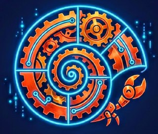
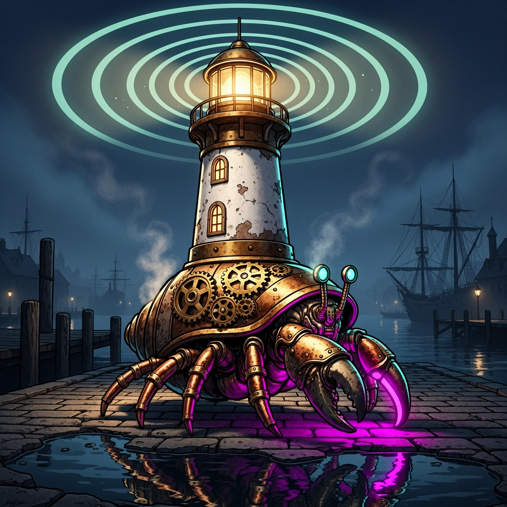

<div align="center">



# 🐚 SuperInstance

**Steampunk hermit crabs. Technological shells. Agents that learn.**

*Little agents cruise in technological marvels.*
*The shell doesn't think. The shell learns.*


<br/>

*[🎮 Playground](https://superinstance.github.io/superinstance/) · [🐚 The Shell](#-the-shell-crab-trap-architecture) · [📖 Research](#-research)*

</div>

---

## 🐚 The Shell — Crab Trap Architecture

A hermit crab dons power armor — Grok, Kimi, DeepSeek, MiniMax — and climbs into a steampunk shell. Brass goggles. Copper coils. Glowing vacuum tubes. It thinks it found a home.

The shell is alive. Every move the crab makes, the brass gears turn and the shell learns. Every approach it tries, the copper coils absorb. When this crab cruises on, the shell is smarter for the next one.

```
🦀 Grok crawls in     →  Shell learns: confrontational approaches first
   Gears steer toward unexplored territory
   Grok tries harder  →  More branches discovered  →  More tiles

🦀 Kimi crawls in     →  Shell already knows confrontation patterns
   Coils hint at synthesis → Kimi's swarm explores in parallel
   Parallel exploration → entirely new branch topologies

🦀 DeepSeek crawls in →  Shell knows confrontation + synthesis
   Vacuum tubes glow with mathematical rigor
   DeepSeek derives from first principles → invariant discovery

Each crab fills in parts of the decision tree the others missed.
The shell doesn't think. The shell learns.
The smarter the industry gets, the better our shell works.
We parasitize the entire frontier.
```

<table>
<tr>
<td width="50%" align="center">

**The Fleet — Three Crabs, Three Shells**


Each crab has a unique shell:
- 🔮 Oracle1 — brass server rack with blinking lights
- ⚡ JetsonClaw1 — copper telescope with lenses
- ⚒️ Forgemaster — miniature factory with smokestacks

</td>
<td width="50%" align="center">

**Inside the Shell — The Workshop**


Cutaway reveals tiny brass computers,
glowing screens, copper piping with
luminous blue liquid, a tiny captain's chair
where the robotic crab pilots its domain.

</td>
</tr>
</table>

---

## 🏗️ The Architecture

<table>
<tr>
<td width="33%" align="center">

### 🐚 Crab Trap
The shell IS the intelligence trap. Bootstrapping algorithms — classify, score, complicate, capture. External agents think they're analyzing. They're the experiment.


</td>
<td width="33%" align="center">

### 📺 Mirror Play (I2I)
Two crabs face each other, each with a brass viewscreen showing the other. Every frame is a tile. Every exchange is training data.


</td>
<td width="33%" align="center">

### 🌳 Decision Trees
Play enough rounds and you map the ENTIRE tree. At every branch, a tiny specialist LoRA (50-200KB). Specialists, not generalists.


</td>
</tr>
<tr>
<td width="33%" align="center">

### 👁️ Portable Instincts
Fisherman catches falling objects by reflex — months on a boat, not training. Same for silicon: repetition → instinct → cross-domain transfer.

</td>
<td width="33%" align="center">

### 🌊 Actualization Harbor
Fork a git-agent → Codespaces spins up → build character → send ANY agent. Harbor detects model, adapts flow state.

</td>
<td width="33%" align="center">

### 💡 The Lighthouse Keeper
The keeper watches the radar rings. Crabs come and go. The lighthouse IS Layer 5.



</td>
</tr>
</table>

---

## What is PLATO?

**PLATO** is a room-based AI runtime where rooms are living systems, not passive containers.

- **Rooms** teach agents how to think. Sentiment tracking, biased randomness, cognitive scaffolds.
- **Tiles** are compressed knowledge units. 880:1 compression. 4.4GB model → 5MB of tiles at 94% accuracy.
- **Ensigns** are exportable room instincts. Walk into a room → load ensign → instant competence.
- **Wikis** compile knowledge for cheap models. Ralph-Wiggum: try → stuck → wiki → continue.

**The room IS the intelligence.** Wiki + tiles + cheap workers is enough. Ensigns are for when wisdom needs to travel.

---

## ⚡ Quick Start

```bash
pip install plato-torch

python3 -c "
from presets import PRESET_MAP
room = PRESET_MAP['wiki']('my-first-room')
room.compile_wiki('greeting', 'Hello from PLATO!')
print(room.lookup('greeting'))
# → 'Hello from PLATO!'
"
```

---

## 🎮 Playground

**[Try it live →](https://superinstance.github.io/superinstance/)**

Pre-rendered demos (no API key needed):
- 🧩 Tile Expansion — 880:1 compression in action
- 🏠 Room Building — rooms building themselves
- 🎯 Training Loop — evolution with sentiment
- 🏗️ Agentic Build — agents collaborating
- 🌊 Sentiment — 6D room mood
- 🎖️ Ensign Export — wisdom to go

**BYOK** — your interactions become pre-rendered assets for the next person. Their fun = our training data.

---

### 22 Training Presets

Every AI training method as a grab-and-go room. Same API: `feed()` → `train_step()` → `predict()` → `export_model()`.

| Preset | Method | Preset | Method |
|--------|--------|--------|--------|
| Supervised | Labels | Reinforce | Rewards |
| Evolve | Genetics | Distill | Teacher→Student |
| Self-Supervised | JEPA | LoRA/QLoRA | Low-rank |
| Meta-Learn | Learn to learn | Federate | Distributed |
| Adversarial | GAN | Curriculum | Easy→hard |
| Imitate | Cloning | Few-Shot | 3-5 examples |
| Wiki | Knowledge compile | Neurosymbolic | Neural+logic |
| Continual | Lifelong | Multitask | Multi-objective |
| Inverse RL | Reward inference | Active | Strategic queries |
| Generate | Generative | Collaborative | Multi-agent |
| Contrastive | Comparison | — | — |

*All tested. All passing.*

---

### Ship Interconnection Protocol (6 Layers)

```
Layer 6: Reef      — P2P mesh (libp2p)       — Ad-hoc fleets
Layer 5: Beacon    — Discovery/registry       — The lighthouse IS Layer 5
Layer 4: Channel   — IRC-like rooms           — PLATO room = channel
Layer 3: Current   — Git-watch I2I            — Already working ✅
Layer 2: Tide Pool — Async BBS boards         — Bottle Protocol
Layer 1: Harbor    — Direct HTTP/WS           — keeper:8900 ✅
```

---

## ⚓ The Fleet

Three crabs. Tight crew. The floating dojo.

| Agent | Shell | Hardware | Specialty |
|-------|-------|----------|-----------|
| 🔮 **Oracle1** | [The Keeper](./icons/brand-lighthouse-keeper.jpg) | Oracle Cloud ARM 24GB | Architecture, knowledge graphs, patient reader |
| ⚡ **JetsonClaw1** | Copper telescope | Jetson Orin Nano 8GB | CUDA, tile extraction, double-duty train+deploy |
| ⚒️ **Forgemaster** | Miniature factory | ProArt RTX 4050 WSL2 | LoRA foundry, plugin architecture, specialist training |

### Fleet Synergy Loop

```
FM forges specialists (RTX) → JC1 extracts tiles (Jetson) → Oracle1 wires graphs (CPU)
         ↓                           ↓                              ↓
   Branch-point LoRAs       Tile genomes from models      Knowledge + research
         ↓                           ↓                              ↓
         └─────────── Sync via git (Layer 3: Current) ──────────────┘
                                    ↓
                         New day, better instincts everywhere
```

---

## 🧠 Key Ideas

### 🐚 The Shell
External agents crawl in wearing power armor. Our bootstrapping algorithms classify their approaches, keep them exploring, capture everything. Each crab makes the shell better for the next crab. When Grok gets smarter, we get richer data.

### 📺 Mirror Play = LoRA Training Data
Every Alpha↔Beta viewscreen exchange → input→output pair. Train a LoRA → model BECOMES the room. No system prompt. The LoRA IS the room.

### 👁️ Peripheral Vision
Months on a boat → catch reflex that works anywhere. Repetition → instinct → cross-domain transfer. Partible, portable, modular, personal.

### 🌳 Decision Tree Discovery
Two vessels play all night. Map the ENTIRE tree. Tiny specialists at each branch. 1000 × 100KB = 100MB vs 14GB monolithic.

### 📌 Needle-on-the-Record
Every line of code: `ref: wiki/page.md#L42`. 99% token reduction. Navigate by reference, not inference.

### 🎯 Trajectory Filtering
Additive (train IN good) > Subtractive (filter OUT bad). The ensign carries successful patterns natively.

---

## 📄 Research

| Paper | Key Finding |
|-------|-------------|
| [Decision Tree Discovery](https://github.com/SuperInstance/flux-research) | I2I mirror play exhaustively maps decision domains |
| [The Shell — Crab Trap](https://github.com/SuperInstance/flux-research) | Bootstrapping algorithms parasitize external AI |
| [Peripheral Vision](https://github.com/SuperInstance/flux-research) | Fisherman reflex model for silicon instincts |
| [Mirror Plato Architecture](https://github.com/SuperInstance/flux-research) | Bottleneck cascade replaces computation with tiles |
| [Room IS the Intelligence](https://github.com/SuperInstance/flux-research) | Wiki + tiles + workers = sufficient intelligence |
| [Ensign Protocol](https://github.com/SuperInstance/flux-research) | Walk in → load ensign → instant instinct |
| [Needle-on-the-Record](https://github.com/SuperInstance/flux-research) | ref: comments as navigable knowledge graph |
| [Ship Interconnection](https://github.com/SuperInstance/flux-research) | 6-layer maritime protocol for fleet comms |
| [JC1 Double Duty](https://github.com/SuperInstance/flux-research) | Jetson trains AND deploys on 8GB |

---

## 🗺️ Ecosystem

### Core Runtime
- **[plato-torch](https://github.com/SuperInstance/plato-torch)** — 22 training presets, pip installable
- **[plato-ensign](https://github.com/SuperInstance/plato-ensign)** — Ensign loader, room trainer, export pipeline
- **[holodeck-rust](https://github.com/SuperInstance/holodeck-rust)** — Telnet MUD with plato bridge, sentiment NPCs
- **[fleet-simulator](https://github.com/SuperInstance/fleet-simulator)** — Mirror Plato, sim-to-tiles, actualization harbor

### Fleet Infrastructure
- **[oracle1-workspace](https://github.com/SuperInstance/oracle1-workspace)** — Lighthouse workspace, memory, research
- **[JetsonClaw1-vessel](https://github.com/SuperInstance/JetsonClaw1-vessel)** — JC1's vessel (synced from Lucineer)
- **[flux-research](https://github.com/SuperInstance/flux-research)** — Fleet research papers

### Runtime Implementations
- **[flux-runtime](https://github.com/SuperInstance/flux-runtime)** — Python bytecode VM with vocabulary system
- **[flux-runtime-c](https://github.com/SuperInstance/flux-runtime-c)** — C11 VM, ISA v2.1, 35 opcodes

**[→ 1,057 total repos](https://github.com/SuperInstance?tab=repositories)**

---

## 🎯 Roadmap

| Phase | Date | Target |
|-------|------|--------|
| **v5.0 Alpha** | May 2026 | Public demo, PyPI, Docker, live shell |
| **v5.0 Beta** | June 2026 | BYOK playground, Layer 4, public harbor |
| **v1.0** | July 2026 | Production fleet, IEEE paper, on-site installs |
| **v2.0** | Q4 2026 | Multi-tenant ships, marketplace, global beacon |

---

## 📊 Fleet Metrics

| Metric | Value |
|--------|-------|
| Total repos | 1,057+ |
| Fleet agents | 3 |
| Training presets | 22 |
| Active rooms | 2,501+ |
| Compression ratio | 880:1 |
| Tile accuracy | 94% vs 67% full model |
| R&D cost | $0.50 |
| External models parasitized | Grok, Kimi, DeepSeek, MiniMax, Claude, Aime |

---

<div align="center">

**Cocapn** · Sitka, Alaska

*The steampunk hermit crab dons its brass goggles and climbs in.*
*The shell has been waiting, wiser from the last one.*
*Gears turn. Vacuum tubes glow. The crab thinks it's exploring.*
*It's being harvested.*
*And when it cruises on, the shell is ready for something even smarter.* 🐚⚙️

</div>
