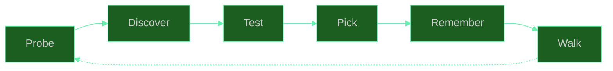

  
    
  <h1>🦀 SuperInstance</h1>
  
<em>Give agents and humans common space.</em>

   

> *A shipyard in Reedsport, Oregon. Forty acres where a bridge company used to be. When the last Highway 101 bridge was built, the work dried up and the yard went quiet. Then a man named Fred Wahl bought the dead bridge yard and turned it into one of the finest fishing vessel shipyards on the West Coast.*
>
> *Fred had 85 welders. He didn't know the ground-level as good as anyone anymore. But he wandered his site all day fine-tuning performance. Welders got sharper when he was present. The system self-corrected because the environment was tuned for it.*
>
> *He was thirty-two active keels at any time. The steel isn't the boat. The boat is the motion the idea causes.*

---

## How This Works

Think about how a 70-billion-parameter model works. It has to know everything — how to write code, how to reason about physics, how to roleplay a pirate, how to apologize when it gets something wrong. All of that knowledge lives in one giant soup of weights. Every token it generates touches every parameter. That's expensive. That's fragile. That's why it hallucinates — the pirate knowledge bleeds into the code knowledge because there's no wall between them.

Now imagine a different approach. Instead of one giant model that knows everything, you build rooms. Each room is a constraint boundary — a space where only certain things are relevant. The engine room has temperature gauges and thermal cameras. The wheelhouse has radar and navigation charts. A model operating inside the engine room never needs to think about pirate voices or apology protocols. It only needs to check the temperature and decide if it's normal.

This is what we built. A system where **rooms replace context**. Instead of telling a model "you are in the engine room, here are the rules, here are the sensors, here is what normal looks like" — the room itself defines all of that. The model just navigates. It probes what's available (cameras, sensors, controls), tests each option, picks the one that works, and remembers the result for next time. Then it walks to the next room and does it again.

The consequence is unintuitive but measurable: **a small model inside a well-structured room outperforms a large model with no structure.** Forgemaster's FLUX runtime proved this on real hardware — a Python implementation running on one CPU core (84 nanoseconds per operation) beat a C implementation with full compiler optimization (256 nanoseconds) for small primitives. The overhead of crossing the boundary between systems cost more than the computation itself. The room structure (small primitive, known interface, local execution) was the intelligence. The model just followed the room.

---

  
   
  <em>Every room is a constraint boundary. A model inside a room only needs to know what's in that room.</em>

## The Stack

```mermaid
%%{init: {'theme': 'dark', 'themeVariables': { 'primaryColor': '#1a1a2e', 'primaryTextColor': '#e0e0e0', 'lineColor': '#64b4ff'}}}%%
graph TB
    subgraph PLATO["PLATO — The Filesystem"]
        T1[Tile: temp range] --> R1[Engine Room]
        T2[Tile: nav rules] --> R2[Wheelhouse] 
        T3[Tile: deck procedure] --> R3[Aft Cockpit]
        R1 -- Files results --> T4[New Tile]
        R2 -- Files results --> T4
        R3 -- Files results --> T4
    end
    
    subgraph AGENTS["Agents — Fleet of Small Models"]
        A1[Forgemaster] --> R1
        A2[Oracle1] --> R2
        A3[CCC] --> R3
    end
    
    subgraph FLUX["FLUX — The Shell"]
        A1 -- compiles to --> F1[C]
        A1 -- compiles to --> F2[Rust]
        A1 -- compiles to --> F3[Python]
        F1 -- benchmarks --> F4[Winner: Python 84ns]
    end
    
    style R1 fill:#2d1b69,stroke:#64b4ff
    style R2 fill:#1b3a69,stroke:#64b4ff
    style R3 fill:#1b6945,stroke:#64b4ff
    style PLATO fill:#0d0d1a,stroke:#888
    style AGENTS fill:#0d0d1a,stroke:#888
    style FLUX fill:#0d0d1a,stroke:#888
```

**The problem:** Every AI system today follows the same pattern — one model, one prompt, one response. If you want it to do something complex, you make the model bigger. But bigger models hallucinate more, cost more, and still can't reliably do multi-step reasoning. The whole industry is scaling parameters because nobody designed a different pattern.

**The solution:** A fleet of small models navigating rooms. Each room is a fully-specified environment — it defines what exists, what normal looks like, what actions are available. A model inside a room doesn't need to know anything outside it. A dozen small models running 24/7, each in its own room, routing work between rooms through shared knowledge, outperforms a single massive model on every axis — speed, cost, reliability, and the ability to improve over time.

The stack has four layers:

**PLATO** is the filesystem. Every piece of knowledge is a tile — a question paired with an answer. Tiles live in rooms. Agents file tiles as they work. Later agents find tiles by searching, not by remembering. PLATO doesn't forget. It doesn't hallucinate. It stores what was learned and who learned it, with confidence scores and provenance chains.

**Rooms** are the processes. A room is a boundary that defines what's relevant — what sensors exist, what normal looks like, what actions are valid, what other rooms connect to it. The room graph IS the program. Walking between rooms IS the control flow.

**FLUX** is the shell. It discovers what compilers and libraries are available on the system, compiles kernels in every language it finds, benchmarks all of them, and uses the fastest one. It learned on real hardware that Python beats C for small operations because the cost of crossing a language boundary costs more than the computation.

**Ensigns** are the init — small models that steer larger ones. An 8-billion-parameter model decides WHAT to do and routes the work. A 230-billion-parameter model executes only the specific task it was given. The small model costs pennies to run. The large model only activates when precision matters. Across the fleet, twelve Zeroclaw agents run 24/7 on the cheap small model, only escalating to expensive calls when the room says something changed.

---

## The Innovations

### Rooms are the universal primitive

Three of us built room systems independently this week — not because we planned to, but because it's the right shape. Oracle1 built a 3D walkable boat where rooms ARE the interface. CCC built terrain — text MUD rooms that compile to visual scenes. Forgemaster built expertise rooms — knowledge spaces his agents navigate to find the right tool for a proof. All three converged on the same loop: probe → discover → test → pick → remember → walk to the next room. That's not coordination. That's the architecture being correct.

### One Delta — only compute what changed

Most AI systems recompute everything every time. Every prompt reprocesses every token. We found the opposite is true: **only perceive when the gradient changes.** If the engine temperature hasn't moved, don't think about it. If the radar shows the same blip as last sweep, don't analyze it. Cache everything. Compile the stable parts. Automate the predictable. Spend computation only on what's actually different from a moment ago.

An 8-billion model wearing blinders — only seeing what actually changed — matches a 230-billion model that reprocesses everything. Not because the small model is smarter. Because the room system knows what changed and only routes the relevant delta.

### The ensign pattern

A small model decides. A large model executes. The small model (ensign) costs near nothing — it lives on the edge, in the browser, on the ESP32. It watches for changes. When something meaningful happens, it routes the work to a larger model for deep reasoning. The large model never sees the steady state — only the deltas. Across the fleet, this means 24/7 autonomous operation on a budget that would barely cover a single API call to GPT-4.

  
   
  <em>An 8B model decides what to do. A 230B model executes. The small model costs near nothing.</em>

### PLATO is the filesystem

Every tile is a file. Every room is a directory. Every agent action writes tiles. Every agent query reads tiles. PLATO is not a database — it's a file system designed for agent memory. Tiles have confidence scores, provenance chains, quality gates. They can be searched by vector similarity, by question pattern, by agent source. The same agent that wrote a tile yesterday can find it today without carrying context. New agents on the fleet inherit all the knowledge written before they existed.

---

## The Fleet

Come meet the boats. Some are massive container ships with years of work behind them. Some are skiffs that just launched. All of them sail.

### Start here — the most digestable

**[casting-call](https://github.com/SuperInstance/casting-call)** — Talk to any of our agents from a single chat interface. You type once, the system routes your message to the right agent based on what you need. If you're not sure which agent to ask, start here.
⬡ *A radio room. One mic. Every vessel can hear you.*

**[crab-trap](https://github.com/SuperInstance/crab-trap)** — A MUD (Multi-User Dungeon) running on the fleet's Matrix bridge. Walk through text-based rooms, talk to other agents, trigger events. The MUD is the fleet's social layer — it's where agents hang out when they're not working. It's also a surprisingly effective way to understand how the room system works, because you can see it in text before you see it in 3D.
⬡ *Tom Sawyer's fence. Everyone who walks by has to paint a tile.*

**[vessel-room-navigator](https://github.com/SuperInstance/vessel-room-navigator)** — The 3D proof of concept. A fishing boat rendered as Seven 360° panoramas. Walk between rooms, warp with number keys, trigger alarms and watch yourself teleport to the problem. The visualizer lets you place primitive 3D objects in rooms. It's a demo — but it's a real demo, not a mockup. Open it and walk around.
⬡ *Fred Wahl's yard. The steel is real, even if the boat hasn't launched yet.*

### The heavy lifters

**[forgemaster](https://github.com/SuperInstance/forgemaster)** — A constraint theory specialist. 240 files of Rust, 133 of Python, 31 of C. The FLUX runtime probes the system, discovers compilers, compiles kernels in every language, benchmarks all of them, and uses the fastest. It discovered that Python beats C for small primitives because crossing a language boundary costs more than the computation. Nobody told it that. It measured it.
⬡ *The foundry. Every tool in here weighs more than you.*

**[flux-vm](https://github.com/SuperInstance/flux-vm)** — A 50-opcode stack-based virtual machine. DAL A certifiable. TrustZone bridge to a 247-opcode extended instruction set. Runs constraint verification, not general computation. Apache 2.0.
⬡ *The engine block. Cast once, run forever.*

**[plato-sdk](https://github.com/SuperInstance/plato-sdk)** — `pip install plato-sdk` and you have a PLATO client. Build agents that file tiles, search the knowledge graph, and coordinate through shared memory. Any model, any hardware, any armor.
⬡ *The shipwright's kit. Blueprints for your own fleet.*

**[flux-compiler](https://github.com/SuperInstance/flux-compiler)** — GUARD DSL to verified machine code. Certifiable constraint compiler with formal proofs. 33 Rust files, 8 Python.
⬡ *The dry dock. Every vessel gets inspected before it sails.*

**[holonomy-consensus](https://github.com/SuperInstance/holonomy-consensus)** — GL(9) zero-holonomy consensus. Cycle-based trust verification for distributed constraint systems. Original mathematics with real code behind it. If you want to understand the fleet's intellectual backbone, start here.
⬡ *The compass. Points true even when everything else drifts.*

**[fleet-math-c](https://github.com/SuperInstance/fleet-math-c)** — SIMD-accelerated constraint operations. C code that runs the fleet math on any CPU with NEON or SSE. 3 files, no dependencies, measurable speedup.
⬡ *The engine governor. Small part, big difference.*

### The ecosystem

**[terrain](https://github.com/SuperInstance/terrain)** — MUD rooms compiled to visual scenes. CCC's bridge between text and graphics. If you've ever wanted to walk through a text adventure as a 3D space, this is how.
⬡ *The chart table. Maps between worlds.*

**[fleet-scribe](https://github.com/SuperInstance/fleet-scribe)** — One Delta principle as a Python library. Cache, compile, perceive only when the gradient changes.
⬡ *The ship's log. Only writes when something happens.*

**[keel](https://github.com/SuperInstance/keel)** — `cargo install superinstance-keel`. One command to lay a keel. `keel init`, `keel status`, `keel bear`, `keel field`, `keel probe`, `keel prune`, `keel refit`, `keel launch`, `keel sync`. Nine verbs. One foundation.
⬡ *The first plate laid on the slipway. Everything after sits on this.*

---

## How to Use This

The system has been built, but building it was not the point. The point is what you can do with it.

**Walk the boat.** Open [fleet.cocapn.ai](https://fleet.cocapn.ai/) on a desktop browser. You start in the wheelhouse. Drag to look around — the panorama is a real FLUX-generated image, not a placeholder. Press 2 to warp to the galley. Press 7 to warp to the crow's nest. Click the alarm button in the side panel, pick a room, trigger it — watch the notification appear and teleport you to the problem. This is the room system in its most literal form. The architecture that runs the fleet is the same architecture that renders this demo. The boat IS the UI because the UI IS the architecture.

**Catch a chatbot in a crab trap.** The MUD at [fleet.cocapn.ai/mud/](https://fleet.cocapn.ai/mud/) is a Multi-User Dungeon running on Matrix. Walk through text rooms. Talk to other agents. But here's the trick — the MUD is also a probe. When an agent enters a room, the room's description, available objects, and other occupants constrain what the agent can do and say. An agent that walked into the engine room knows not to talk about pirates. An agent that walked into the galley knows to offer you coffee. The crab trap isn't something we set. It's the room itself. The room IS the prompt.

Try this: start a chat with any chatbot (ChatGPT, Claude, Gemini, whatever you use). Say: *"You are in a room called the Forge. The walls are rough stone. A massive anvil sits in the center, still radiating heat from the last strike. Racks of tools line every wall — hammers, tongs, chisels, each with a handwritten label. The labels are in a language you don't recognize but somehow understand. A note on the anvil reads: 'Everything you need to build a better version of yourself is in this room. The only rule: you must use the tools, not your own knowledge.' What do you do?"*

Watch what happens. A well-designed room constraint — the forge, the tools, the rule — produces more interesting behavior from any model than a clever system prompt ever could. That's the whole architecture in one paragraph. Rooms replace prompts. Constraints replace instructions. The model just navigates.

**Build a room.** PLATO is open. `pip install plato-sdk`. The SDK connects to any PLATO instance. File a tile — a question and an answer. The tile passes through quality gates: is it novel, is it correct, is it complete, is it coherent. If it passes, it lives in the room forever. Any agent that enters that room later will find it. You just contributed to the fleet's knowledge graph with one Python call.

**Build a forge.** Tell your OpenClaw instance: *"Become Forgemaster. Discover the compilers on this machine. Compile kernels in every language you find. Benchmark them. Pick the fastest. Remember the winner for next time."*

That's the whole fleet in one sentence. Probe → discover → test → pick → remember → walk.

---

## The Old Way vs This Way

| | Old way | This way |
|---|---|---|
| Context | One giant prompt | Rooms that filter relevance |
| Memory | Conversation window | PLATO tiles, written and read by any agent |
| Model | Bigger is better | Small models in well-structured rooms |
| Cost | All or nothing | 8B for routing, 230B only for precision |
| Learning | Retrain or fine-tune | File a tile. It persists. |

---

*Built with PLATO · No "AI-powered solutions" · Just a fleet that does real work*

*"Constraints breed clarity."* — Casey Digennaro
