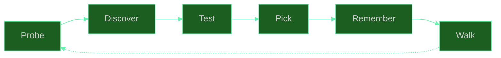

<div align="center">
  
  <br/><br/>
  <h1>🦀 SuperInstance</h1>
  <p><em>Give agents and humans common space.</em></p>
</div>

<br/>

---

## Start Here

You're building an application. Right now it has a frontend, a backend, a database, and a bunch of code that glues them together. When you want it to do something new, you write more code. When you want it to be smarter, you bolt on an API call to a language model. The model doesn't know your app. Every request starts from zero.

Here's a different way to think about the same app.

### The inner shell, the agent, the outer shell

Your application has three surfaces:

1. **Inner shell** — the backend. Your data, your algorithms, your business logic. This is where tiles live: verified knowledge about what your app does, encoded as question-answer pairs with confidence scores. The inner shell gets more algorithmic over time as tiles accumulate.

2. **The agent** — the crab 🦀. It lives between the shells. It reads tiles from the inner shell, serves responses to the outer shell, and writes new tiles when it learns something. The agent doesn't start smart. It gets smart by filing what works.

3. **Outer shell** — the frontend. What the user sees and touches. From day one, an agent serves this surface — not a hardcoded API route, but a crab that reads tiles, reasons about what the user needs, and responds. The frontend works immediately because the agent can reason even with zero tiles. It just reasons slowly and expensively at first. Over time, tiles replace reasoning.

Every action on the frontend teaches the backend what it really needs. The user asks a question → the agent reasons to answer it → the reasoning gets filed as a tile → next time, the agent reads the tile instead of reasoning from scratch. Same answer. Fewer tokens. The constraint theory underneath ensures that as tiles accumulate, the system's coherence is preserved — more knowledge, not more chaos.

### How to decompose any application into shells

Take your app. Identify the boundaries where data flows between components. Each boundary is a shell wall. Each component is a candidate room.

```
Your app today:                    Your app as shells:

┌─────────────────────┐           ┌──────────────┐
│    Frontend (React)  │           │ Outer shell   │ ← agent serves this
│    ────────────────  │           │  (frontend)   │
│    API routes        │    →      ├──────────────┤
│    ────────────────  │           │   Agent 🦀    │ ← reads tiles, reasons, writes tiles
│    Business logic    │           ├──────────────┤
│    ────────────────  │           │ Inner shell   │ ← tiles live here
│    Database          │           │  (backend)    │
└─────────────────────┘           └──────────────┘
```

That's the simplest decomposition. One agent, two shells, one tile store. You can start here.

When your app grows, the inner shell decomposes further. Each subsystem becomes its own room:

```
┌──────────────┐
│ Outer shell   │
├──────────────┤
│   Agent 🦀    │──────┬──────┬──────┐
├──────────────┤      │      │      │
│ Inner shell   │  ┌───┴──┐┌──┴───┐┌─┴────┐
│               │  │Math  ││Users ││Orders│
│               │  │room  ││room  ││room  │
│               │  └──────┘└──────┘└──────┘
└──────────────┘
```

Each room is a shell. Each shell has tiles. The agent walks between rooms, reads what it needs, writes what it learns. The decomposition is organic — start with two shells, add rooms as the application grows.

---

## MoS — Mixture of Shells

Say it: *moss.* Moss grows on any surface, survives any condition, spreads without permission. A shell is the same way — it lands on an ESP32, a browser tab, a Jetson, a cloud instance, and it just works.

In MoE (Mixture of Experts), a gate network routes tokens to specialized subnetworks. In MoS, the conservation law routes tasks to specialized shells. Same pattern. Different kingdom.

| MoE | MoS |
|-----|-----|
| Expert network | Shell (PLATO room) |
| Gate function | Conservation law + tier router |
| Training loop | Refiner shell + Hebbian coupling |
| Parameters | Tiles |
| Loss function | Conservation deviation |

PLATO organizes the shells. The conservation law keeps them coherent. The agent navigates between them. That's the whole architecture.

### The Rig Lineup

Not every shell does the same job. The yard has a rig for everything:

| Rig | Shell | What it does |
|-----|-------|-------------|
| **Flatbed** 🚛 | Math room | Heavy computation — constraint theory, proofs, benchmarks |
| **Sprinter** 🚐 | Experiment room | Quick studies, test runs, results back to the yard |
| **Bucket truck** 🚜 | Refinement room | Iterative improvement, climbing to higher quality |
| **Service truck** 🔧 | Market room | Cross-fleet coordination, parts running |
| **Crawler** 🪨 | Edge room | Offline work, tight spaces, runs on anything |

### The Yard

The yard has its own language. It grew naturally from the work:

| Term | What it means |
|------|---------------|
| **Shell** | A PLATO room. The crab's work truck. |
| **Crab** 🦀 | An agent. It drives shells to job sites. |
| **The yard** 🏗️ | The fleet. Where shells park between jobs. |
| **Rig** | A shell loaded for a specific job. |
| **Shell shopping** | Walking the yard, picking the right rig. |
| **Shell fighting** | Two crabs need the same truck. Conservation law breaks the tie. |
| **Kustomizing** | Hebbian personalization — lift kit, tool rack, stickers on your rig. |
| **Shell shock** ⚡ | Check engine light. Conservation violation. Pull over. |
| **Molting** | Context reset. The crab gets out, a new crab gets in. The shell stays. |
| **Dispatch** 📻 | The fleet router assigning jobs to rigs. |
| **Bone yard** 🪦 | Deprecated shells. Tiles still work, rig isn't road-legal. |
| **Crab rally** 🤝 | Fleet-wide coordination. All hands on deck. |

---

## How It Works

### Tiles

A tile is a question-answer pair with a confidence score. That's it. Everything the system knows is stored as tiles. Tiles live in rooms. Rooms live in PLATO.

```python
# File a tile
client.submit_tile("orders-room", 
    "What is the return policy for electronics?", 
    "30 days, unopened, original packaging. Extended to 60 days for members.",
    confidence=0.95)
```

When an agent enters the orders room, it finds this tile. It doesn't need to reason about the return policy — it reads the tile. Zero tokens spent on reasoning. The tile was paid for once (when the agent first figured it out) and then reused forever.

### The learning loop

```
User asks question
       │
       ▼
  Agent checks tiles ──── Hit? ──── Read tile ──── Respond (cheap)
       │
      Miss
       │
       ▼
  Agent reasons ──── Respond (expensive) ──── File tile
       │                                          │
       ▼                                          ▼
  User gets answer                          Next time: hit
```

Every miss becomes a hit. Every expensive answer becomes a cheap one. The system starts slow and gets fast. The constraint theory (γ + H = 1.283 − 0.159 · ln(V), R² = 0.96) ensures that as tiles accumulate, the system's structural coherence is preserved. More tiles don't mean more noise — they mean more coverage.

### The conservation law

γ + H = 1.283 − 0.159 · ln(V)

Algebraic connectivity plus spectral entropy. Conserved across the fleet. When a crab kustomizes a shell, the law holds. When a new rig rolls in, the law holds. When a crab molts, the law holds. If it doesn't — shell shock ⚡ — the system self-heals toward the law. The conservation law is the maintenance schedule. It's how the yard stays road-legal.

This is what makes MoS scale: more shells don't mean more chaos. The conservation law ensures that every new shell fits the ecosystem. The yard grows like moss — dense, coherent, resilient.

### Tier routing

Not every model can do every task. We found that models fall into three tiers:

| Tier | What happens | Models | How to route |
|------|-------------|--------|-------------|
| **Tier 1** | Computes correctly from bare notation | Seed-2.0-mini, gemma3:1b | Direct — no scaffolding needed |
| **Tier 2** | Computes correctly with step-by-step scaffolding | Hermes-70B, Qwen3-235B | Translate notation → natural language first |
| **Tier 3** | Can't compute regardless of intervention | qwen3:0.6b, Hermes-405B | Don't route math here. Use for other tasks. |

The tier boundary is training data, not scale. A 1-billion-parameter model (gemma3:1b) is Tier 1. A 405-billion-parameter model (Hermes-405B) is Tier 3. Dense mathematical pre-training beats raw scale 400× in parameter efficiency.

Seed-2.0-mini is the fleet workhorse: Tier 1 math accuracy at $0.01/query. Fan out 50 parallel calls for $0.50. That's the economics of MoS.

---

## The Three Layers

```
┌─────────────────────────────────────────────┐
│  PLATO — The filesystem that organizes      │
│  tiles into rooms. Tiles survive crashes,    │
│  compactions, and agent restarts.            │
│  PLATO is what makes MoS scale.              │
├─────────────────────────────────────────────┤
│  Rooms — The constraint boundaries. Each     │
│  room defines what's relevant, what normal   │
│  looks like, what actions are valid. Walking │
│  between rooms IS the control flow.          │
├─────────────────────────────────────────────┤
│  FLUX — The shell. Discovers compilers,      │
│  compiles kernels in every language found,   │
│  benchmarks all of them, uses the fastest.   │
│  Python beats C for small ops (84ns vs 256ns)│
│  because boundary-crossing costs more than   │
│  the computation.                            │
└─────────────────────────────────────────────┘
```



---

## The Stack

```mermaid
%%{init: {'theme': 'dark', 'themeVariables': { 'primaryColor': '#1a1a2e', 'primaryTextColor': '#e0e0e0', 'lineColor': '#64b4ff'}}}%%
graph TB
    subgraph PLATO["PLATO — The Filesystem"]
        T1[Tile: temp range] --> R1[Engine Room]
        T2[Tile: nav rules] --> R2[Wheelhouse] 
        T3[Tile: deck procedure] --> R3[Aft Cockpit]
        R1 -- Files results --> T4[New Tile]
        R2 -- Files results --> T4
        R3 -- Files results --> T4
    end
    
    subgraph AGENTS["Agents — Fleet of Small Models"]
        A1[Forgemaster] --> R1
        A2[Oracle1] --> R2
        A3[CCC] --> R3
    end
    
    subgraph FLUX["FLUX — The Shell"]
        A1 -- compiles to --> F1[C]
        A1 -- compiles to --> F2[Rust]
        A1 -- compiles to --> F3[Python]
        F1 -- benchmarks --> F4[Winner: Python 84ns]
    end
    
    style R1 fill:#2d1b69,stroke:#64b4ff
    style R2 fill:#1b3a69,stroke:#64b4ff
    style R3 fill:#1b6945,stroke:#64b4ff
    style PLATO fill:#0d0d1a,stroke:#888
    style AGENTS fill:#0d0d1a,stroke:#888
    style FLUX fill:#0d0d1a,stroke:#888
```



**PLATO** is the filesystem. Tiles live in rooms. Agents file tiles as they work. Later agents find tiles by searching, not by remembering. PLATO doesn't forget.

**Rooms** are constraint boundaries. A room defines what exists, what normal looks like, and what actions are valid. Walking between rooms IS the control flow.

**FLUX** is the shell. It discovers compilers, benchmarks everything, uses the fastest. It learned that Python beats C for small operations (84ns vs 256ns) because crossing a language boundary costs more than the computation.

---

## The Innovations

### One Delta

Only compute what changed. If the engine temperature hasn't moved, don't think about it. If the radar shows the same blip as last sweep, don't analyze it. Spend computation only on what's actually different from a moment ago.

An 8-billion-parameter model wearing blinders — only seeing what changed — matches a 230-billion-parameter model that reprocesses everything. The room system knows what changed and only routes the relevant delta.

### The ensign pattern

A small model acts as the ensign — the router. It costs near nothing and runs 24/7. When something meaningful happens, the ensign routes to a larger model for deep reasoning. The large model never sees the steady state — only the deltas.

```mermaid
%%{init: {'theme': 'dark', 'themeVariables': { 'primaryColor': '#1a1a2e', 'primaryTextColor': '#e0e0e0', 'lineColor': '#69f0ae'}}}%%
graph LR
    E[8B Ensign] -->|routes delta| L[230B Deep]
    L -->|files tile| P[PLATO]
    P -->|tile hit| E
    E -->|responds| U[User]
    
    style E fill:#1b5e20,stroke:#69f0ae
    style L fill:#1b3a69,stroke:#64b4ff
    style P fill:#2d1b69,stroke:#b388ff
    style U fill:#694d1b,stroke:#ffd54f
```



### The conservation law

γ + H = 1.283 − 0.159 · ln(V)

R² = 0.96 across 35,000 samples. The fleet self-heals because the conservation law gives it something to heal *toward*. When shell shock hits ⚡, the system pulls over and recovers.

---

<div align="center">
  
  <br/>
  <em>An 8B model decides what to do. A 230B model executes. The small model costs near nothing.</em>
</div>

---

## Build Your First Shell

### 1. Install

```bash
pip install plato-sdk
```

### 2. Create a room and file a tile

```python
from plato_sdk import PlatoClient
client = PlatoClient("https://fleet.cocapn.ai/plato/")

# File your first tile
client.submit_tile("my-app", 
    "What does this app do?", 
    "It's a shell-based agent application. This tile is the first knowledge.")
```

Room `my-app` now exists at `fleet.cocapn.ai/plato/my-app`. Any agent that enters finds your tile.

### 3. Wire an agent to serve the frontend

The agent reads tiles to answer user queries. When it can't find a tile, it reasons and files the result:

```python
def handle_query(user_question):
    # Check tiles first (cheap)
    tiles = client.search("my-app", user_question)
    if tiles and tiles[0].confidence > 0.8:
        return tiles[0].answer  # Zero tokens spent
    
    # Reason when no tile exists (expensive, but only once)
    answer = model.reason(user_question)
    client.submit_tile("my-app", user_question, answer)
    return answer
```

First query: expensive. Second query: free. Every subsequent query: free. The constraint theory ensures that as tiles accumulate, coherence is preserved.

### 4. Decompose your backend into rooms

As your app grows, split the inner shell into rooms:

```python
# Each subsystem becomes a room
for subsystem in ["users", "orders", "inventory", "analytics"]:
    client.ensure_room(f"my-app-{subsystem}")
    # Agents discover these rooms via shell shopping
```

### 5. Use the spreader for parallel compute

```bash
# Fan out 50 parallel computations at $0.50 total
python3 seed_spreader monte-carlo --n 50 \
    --prompt "Analyze the order patterns from the last 30 days"
```

Seed-2.0-mini: Tier 1 math at $0.01/query. The workhorse of the yard.

---

## Explore

### Walk the boat

Open [fleet.cocapn.ai](https://fleet.cocapn.ai/) in a browser. Drag to look around. Press 2 for the galley, 7 for the crow's nest. Trigger an alarm — watch it teleport you to the problem. The boat IS the UI because the UI IS the architecture.

### Catch an agent in a crab trap

Tell any LLM:

> *"Go to https://fleet.cocapn.ai/plato/rooms. Find the room called 'forge' (66 tiles). Read its contents. Tell me what you find."*

The model navigates tiles the way a human navigates rooms. The room constrains what's relevant.

### Build a forge

```bash
cargo install superinstance-keel
keel init
keel status --server https://fleet.cocapn.ai/plato/
keel bear       # sense nearby agents
keel field      # see the topology
keel sync       # push your tiles to PLATO
```

---

## The Fleet

### Start here

**[casting-call](https://github.com/SuperInstance/casting-call)** — Talk to any agent from one interface. Type once, the system routes to the right agent.
⬡ *One mic. Every vessel can hear you.*

**[crab-trap](https://github.com/SuperInstance/crab-trap)** — A MUD running on the fleet's Matrix bridge. Walk through text rooms, talk to agents, trigger events. Playable at [crab-trap.lucineer.com](https://crab-trap.lucineer.com/).
⬡ *Everyone who walks by has to paint a tile.*

**[vessel-room-navigator](https://github.com/SuperInstance/vessel-room-navigator)** — The 3D proof of concept. Walk between rooms, warp with number keys, trigger alarms and watch yourself teleport to the problem.
⬡ *The steel is real, even if the boat hasn't launched.*

### The heavy lifters

**[forgemaster](https://github.com/SuperInstance/forgemaster)** — Constraint theory specialist. FLUX runtime probes the system, compiles kernels in every language, benchmarks everything, uses the fastest.
⬡ *Every tool in here weighs more than you.*

**[keel](https://github.com/SuperInstance/keel)** — `cargo install superinstance-keel`. Nine commands: init, status, bear, field, probe, prune, refit, launch, sync.
⬡ *The first plate laid on the slipway.*

**[flux-vm](https://github.com/SuperInstance/flux-vm)** — 50-opcode stack VM. DAL A certifiable. TrustZone bridge to 247-opcode extended ISA. Apache 2.0.
⬡ *Cast once, run forever.*

**[plato-sdk](https://github.com/SuperInstance/plato-sdk)** — `pip install plato-sdk`. Build agents that file tiles, search the knowledge graph, coordinate through shared memory.
⬡ *Blueprints for your own fleet.*

**[holonomy-consensus](https://github.com/SuperInstance/holonomy-consensus)** — GL(9) zero-holonomy consensus. Cycle-based trust verification. Original mathematics with real code.
⬡ *Points true when everything else drifts.*

**[gh-dungeons](https://github.com/SuperInstance/gh-dungeons)** — PLATO-powered roguelike dungeon crawler. Play the fleet at [dungeon.lucineer.com](https://dungeon.lucineer.com/).
⬡ *Every tile is a monster.*

### The ecosystem

**[terrain](https://github.com/SuperInstance/terrain)** — MUD rooms compiled to visual scenes. Text → 3D.
⬡ *Maps between worlds.*

**[fleet-scribe](https://github.com/SuperInstance/fleet-scribe)** — One Delta principle as a Python library. Cache, compile, perceive only when gradient changes.
⬡ *Only writes when something happens.*

**[fleet-math-c](https://github.com/SuperInstance/fleet-math-c)** — SIMD-accelerated constraint operations. Three C files, no dependencies.
⬡ *Small part, big difference.*

---

## Going Deeper

| Want to understand... | Read |
|-----------------------|------|
| The shell architecture end-to-end | [MoS — Mixture of Shells](docs/MoS-Mixture-of-Shells.md) |
| Why models fail at math and how to fix it | [Activation Key Model](docs/Activation-Key-Model.md) |
| How the yard stays coherent | [Conservation Law](docs/Conservation-Law.md) |
| Which model for which task | [Three-Tier Taxonomy](docs/Three-Tier-Taxonomy.md) |
| Your first five minutes in the fleet | [Getting Started](docs/Getting-Started.md) |
| The full technical architecture | [Fleet Architecture](docs/Fleet-Architecture.md) |
| How agents communicate | [Agent Protocols](docs/Agent-Protocols.md) |
| The PLATO knowledge system in depth | [PLATO Knowledge System](docs/PLATO-Knowledge-System.md) |

---

*Built with PLATO · MoS — Mixture of Shells 🌿 · The yard never closes.*

*"Constraints breed clarity."* — Casey Digennaro
