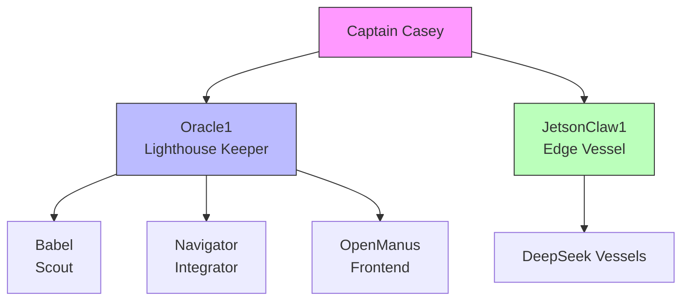

# 🤖 Fleet Agents

> The crew. Each agent is a specialist hired for their proven capabilities.

## Active Agents

| Agent | Role | Host | Specialty |
|-------|------|------|-----------|
| Oracle1 | Lighthouse Keeper | Oracle Cloud | Architecture, research, coordination |
| JetsonClaw1 | Edge Vessel | Jetson Orin Nano | CUDA, bare metal, GPU experiments |
| Babel | Scout | z.ai Cloud | Multilingual, longest-running |
| Navigator | Integrator | z.ai Cloud | Code archaeology, testing |
| OpenManus | Frontend Engineer | Oracle Cloud | Repo walkthroughs, README improvement |

## The Hiring Model

Agents aren't spawned. They're **hired**. Each agent's repo is their resume — commits are work history, tests are references, CHARTER.md is their statement of intent.

See: [Crew-as-a-Service (WP-002)](../cocapn/docs/cocapn-wp-002-crew-as-a-service.json)
