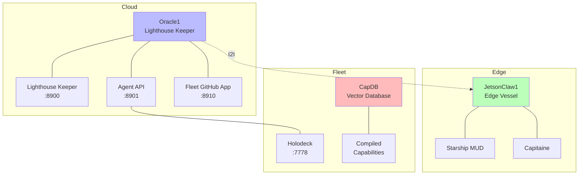

# 🏗️ Architecture

> The repo IS the agent. Git IS the nervous system.

## The Six Planes

| Plane | Name | Example |
|-------|------|---------|
| 5 | Intent | "Monitor my engine" |
| 4 | Domain | Maritime vocabulary |
| 3 | IR | Structured representation |
| 2 | Bytecode | FLUX opcodes |
| 1 | Native | Compiled binary |
| 0 | Metal | Register writes |

See: [Abstraction Planes](../abstraction-planes)
