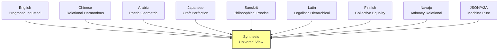

# 🌍 Cultural Perspectives

> The same fleet, reasoned in 8 maximally distant language traditions.

## Why 8 Languages?

Not translation. **Separate reasoning traditions** building the same system from different cultural DNA. When we synthesize, we're not finding the English version in other languages — we're finding what's universal across all perspectives.

| Language | Tradition | Key Value |
|----------|-----------|-----------|
| [English](../fleet-english) | Pragmatic industrial | Efficiency |
| [Chinese](../fleet-chinese) | Relational harmonious | Balance |
| [Arabic](../fleet-arabic) | Poetic geometric | Beauty + Precision |
| [Japanese](../fleet-japanese) | Craft perfection | Mastery |
| [Sanskrit](../fleet-sanskrit) | Philosophical precise | Dharma |
| [Latin](../fleet-latin) | Legalistic hierarchical | Order |
| [Finnish](../fleet-finnish) | Collective equality | Sisu |
| [Navajo](../fleet-navajo) | Animacy relational | Hozho |
| [JSON](../fleet-json-a2a) | Machine pure | Completeness |
