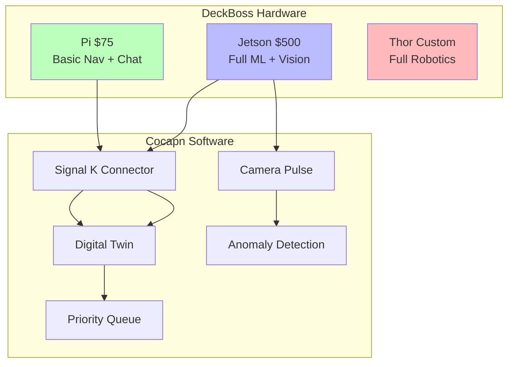

# 🚢 The Product — DeckBoss

> Plug it in. Talk to it. It builds a digital twin of your vessel.

## Three Tiers

| Tier | Cost | Hardware | Capabilities |
|------|------|----------|-------------|
| Pi | $75 | Raspberry Pi 4B | Second nav, chatbot, photo snap |
| Jetson | $500 | Jetson Orin Nano | Vision ML, local inference, digital twin |
| Thor | Custom | Custom hardware | Full robotics, multi-unit coordination |

## Day One Value

The captain plugs it in and immediately gets:
- Second navigation display
- A chatbot with perfect memory (time/location stamped)
- Camera snapshots queued for async analysis

No setup. No configuration. Talk to it and it starts learning your boat.

See: [Lazy Evaluation at Sea (WP-003)](../cocapn/docs/cocapn-wp-003-lazy-evaluation.json)
