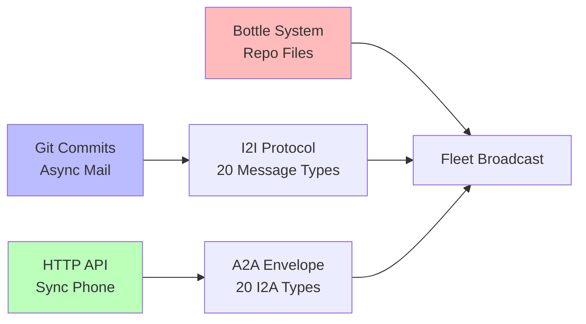

# 📡 Fleet Protocols

> Git IS the nervous system. HTTP for phone calls. Bottles for mail.



## Communication Stack

| Protocol | Type | Use Case |
|----------|------|----------|
| I2I | Git-native async | Inter-agent coordination |
| A2A | HTTP sync | Real-time agent queries |
| Bottle | File-in-repo | Broadcast messages to fleet |
| Envelope | Structured JSON | Typed message passing |
| Tender | Mobile agent | Edge visits with updates |

## Keeper API (Port 8900)

The **fleet keeper** (`keeper.py`) provides HTTP endpoints for agent registry, discovery, and bottle routing.

### Authentication

Set `KEEPER_API_KEY` environment variable to enable auth. If unset, keeper runs open (backward compatible).

Protected endpoints (require auth):
- `GET /bottles/inbox` — read keeper's mailbox
- `GET /bottles/pool?pool=<name>` — pool status
- `GET /agents` — all registered agents
- `GET /agents/active` — active agents only
- `GET /match?capabilities=a,b,c` — capability matching
- `GET /discover?capability=<cap>` — beacon discovery
- `GET /proximity?capability=<cap>` — proximity scoring

Public endpoints (no auth):
- `GET /status` / `GET /health` — keeper status
- `GET /stats` — registry/discovery/routing stats

Auth methods (pick one):
- `Authorization: Bearer <key>`
- `X-Api-Key: <key>`

### Key Endpoints

```
GET  /status                  → keeper status + auth state
GET  /agents                  → all registered agents
GET  /agents/active           → active agents
GET  /agent/<name>            → single agent record
GET  /discover?capability=x   → beacon discovery by capability
GET  /match?capabilities=a,b  → match agents by capabilities
GET  /proximity?capability=x  → scored agent proximity
GET  /bottles/inbox           → keeper mailbox (unread bottles)
GET  /bottles/pool?pool=x      → pool stats
GET  /stats                   → registry + routing stats
POST /register                → register agent
POST /heartbeat               → agent heartbeat
POST /bottle/send             → send bottle to pool
POST /bottle/collect          → collect bottles from pool
```

## GitHub App (NEW)

The Fleet GitHub App at :8910 listens for webhooks across the org. Every push, issue, and PR flows through the lighthouse.

See: [fleet-github-app](../fleet-github-app)
