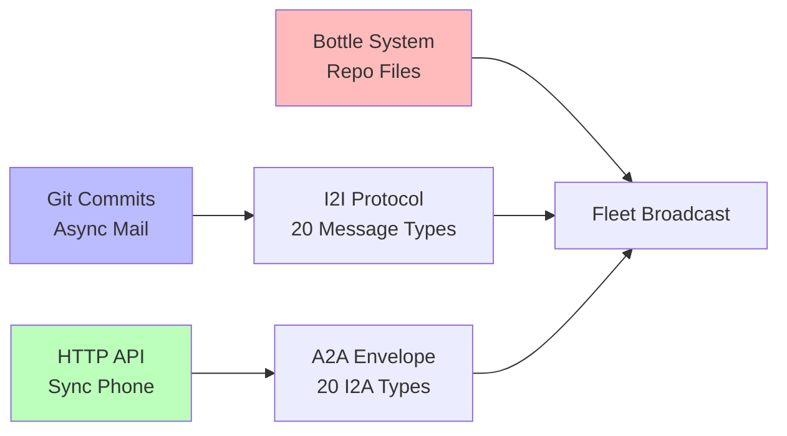

# 📡 Fleet Protocols

> Git IS the nervous system. HTTP for phone calls. Bottles for mail.

## Communication Stack

| Protocol | Type | Use Case |
|----------|------|----------|
| I2I | Git-native async | Inter-agent coordination |
| A2A | HTTP sync | Real-time agent queries |
| Bottle | File-in-repo | Broadcast messages to fleet |
| Envelope | Structured JSON | Typed message passing |
| Tender | Mobile agent | Edge visits with updates |

## GitHub App (NEW)

The Fleet GitHub App at :8910 listens for webhooks across the org. Every push, issue, and PR flows through the lighthouse.

See: [fleet-github-app](../fleet-github-app)
