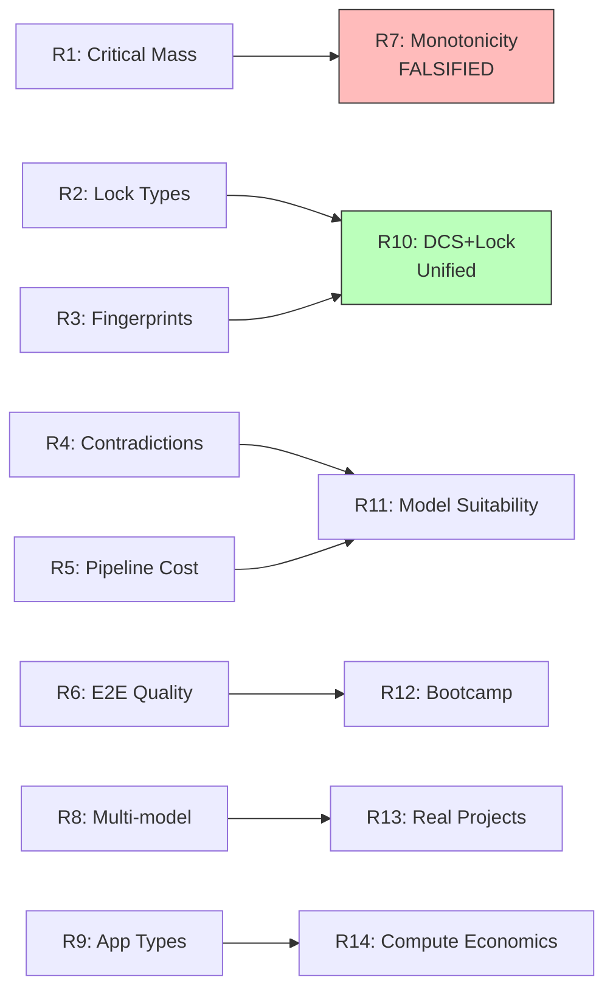

# 🔬 Research

> 11 rounds of experiments. 40+ individual tests. Total cost: $0.50.

## Key Findings

1. **Lock critical mass >= 7** for compilation consistency
2. **Monotonicity FALSIFIED** — more constraints ≠ better (real science!)
3. **DCS + Lock = same phenomenon** — constrained entropy reduction
4. **Cross-model portability 80%** — locks transfer across models
5. **Embedding space IS the type system** — the semantic compiler thesis

## White Papers (A2A-native JSON)

All at [cocapn/docs/](../cocapn/docs/):
1. Forcing Function Architecture
2. Crew-as-a-Service
3. Lazy Evaluation at Sea
4. Compiled Agency
5. The Bootstrap Bomb
6. The Semantic Compiler
